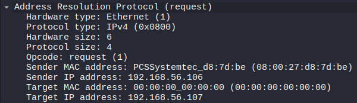
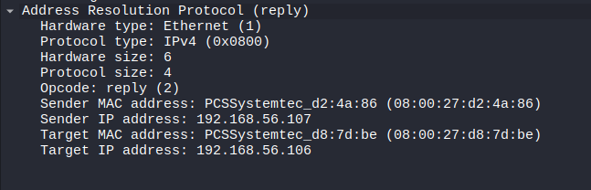

# ARP Protocol Analysis

## Objective
Analyze how the Address Resolution Protocol (ARP) resolves IP addresses to MAC addresses within a local network.

## Lab Environment
- Kali Linux (traffic generation and packet capture)
- Ubuntu Server (target machine)

## Network Configuration
- Kali Linux : 192.168.56.107
- Ubuntu Server : 192.168.56.106
- Network Type : Host-only network

## Tools Used
- Wireshark (packet capture and analysis)
- arping (to generate ARP requests)

## Procedure

### Step 1 – Start Packet Capture
Open Wireshark on Kali Linux and start capturing packets on the active network interface.

### Step 2 – Apply Filter
Apply the following filter to capture only ARP traffic:

arp

### Step 3 – Generate ARP Traffic
Run the following command on Kali Linux:

arping 192.168.56.106

### Step 4 – Observe Packets
Monitor the ARP request and ARP reply packets in Wireshark.

## Observation

### ARP Request

The ARP request is broadcast by the source host (192.168.56.107) to discover the MAC address associated with the target IP address (192.168.56.106).  
The packet contains the sender’s IP and MAC address and is sent to all devices in the local network.

### ARP Reply

The target host (192.168.56.106) responds with its MAC address in the ARP reply.  
This reply is unicast back to the sender, allowing the source host to update its ARP cache and communicate directly using the resolved MAC address.

### Key Observations

- ARP request is a broadcast frame sent to all devices in the local network.  
- ARP reply is a unicast frame sent directly to the requesting host.  
- The protocol maps Layer 3 IP addresses to Layer 2 MAC addresses.  
- ARP communication occurs before actual data transfer between hosts.

## Security Relevance

ARP does not include any authentication mechanism.  
An attacker can exploit this weakness using ARP spoofing to associate their MAC address with another IP address, enabling Man-in-the-Middle attacks within a local network.

## Conclusion

ARP is a fundamental protocol used for resolving IP addresses to MAC addresses in a local network.  
Its lack of authentication makes it vulnerable to spoofing attacks, which can be leveraged for intercepting network traffic.
