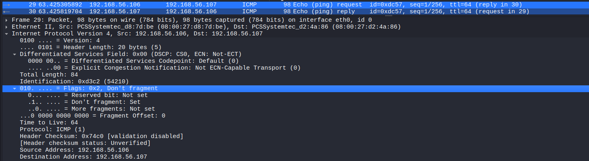
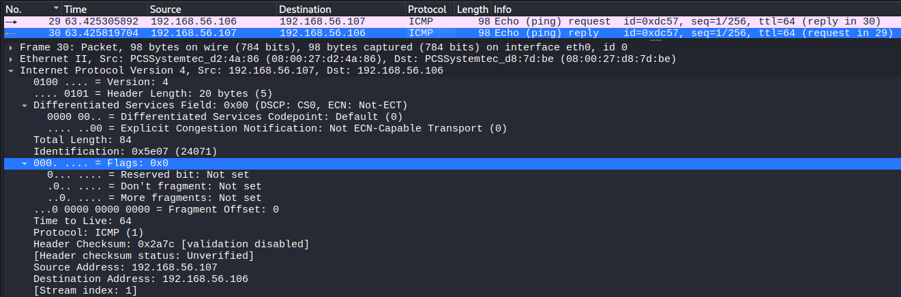
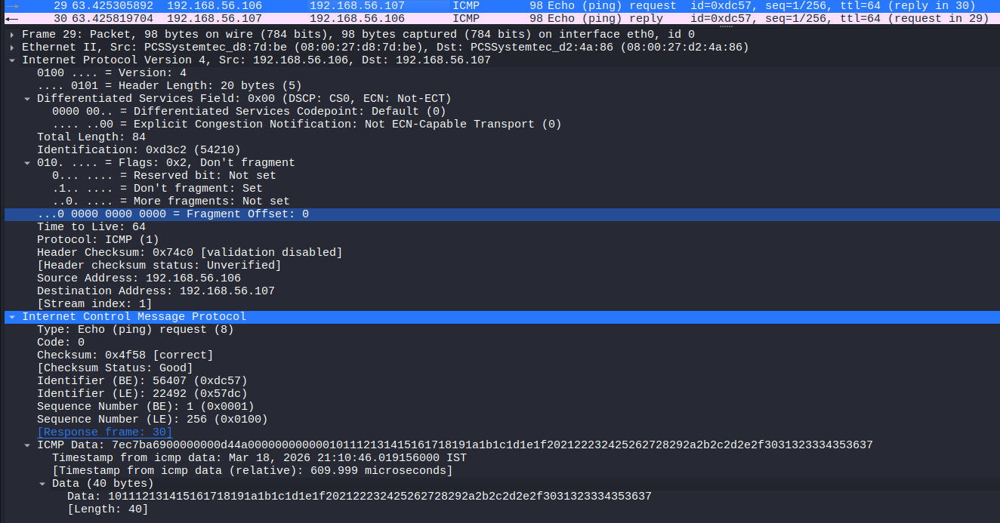

# ICMP Ping Analysis

## Objective
Analyze ICMP Echo Request and Echo Reply messages to understand how network connectivity is tested between two hosts.

## Lab Environment
- Kali Linux (traffic generation and packet capture)
- Ubuntu Server (target machine)

## Network Configuration
- Kali Linux : 192.168.56.107
- Ubuntu Server : 192.168.56.106
- Network Type : Host-only network

## Tools Used
- Wireshark (packet capture and analysis)
- ping (to generate ICMP traffic)

## Procedure

### Step 1 – Start Packet Capture
Open Wireshark on Kali Linux and start capturing packets on the active network interface.

### Step 2 – Apply Filter
Apply the following filter to capture only ICMP traffic:

icmp

### Step 3 – Generate Traffic
Run the following command:

ping 192.168.56.106

### Step 4 – Observe Packets
Observe ICMP Echo Request and Echo Reply packets in Wireshark.

## Observation

### ICMP Echo Request

The source host (192.168.56.107) sends an ICMP Echo Request to the destination (192.168.56.106) to check connectivity.

### ICMP Echo Reply

The destination host responds with an ICMP Echo Reply, confirming that the host is reachable.

### Packet Details

- TTL (Time To Live) indicates the number of hops a packet can traverse before being discarded.  
- Sequence number increments with each request, helping track packet order.  
- Identifier remains constant for a session, linking request and reply packets.

### Key Observations

- ICMP is used for network diagnostics and connectivity testing.  
- Communication occurs in a request-response format.  
- No port numbers are used in ICMP packets.  

## Security Relevance

ICMP can be used for network reconnaissance to identify active hosts.  
Abnormal ICMP patterns may indicate scanning activity or covert communication such as ICMP tunneling.

## Conclusion

ICMP provides a simple mechanism for testing network connectivity between hosts.  
It plays a key role in network diagnostics but can also be misused for reconnaissance and data exfiltration.
