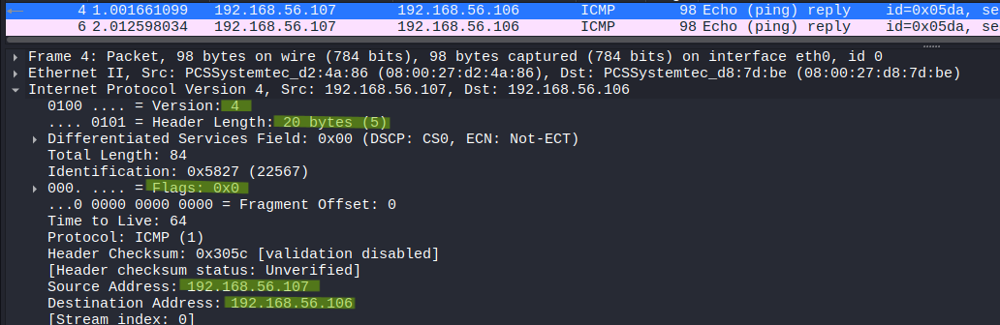
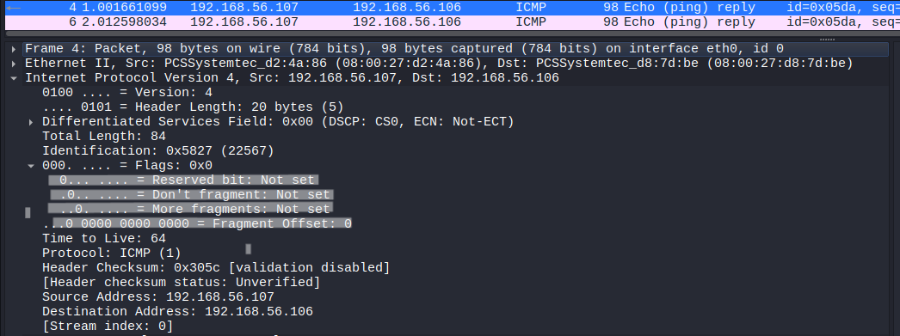
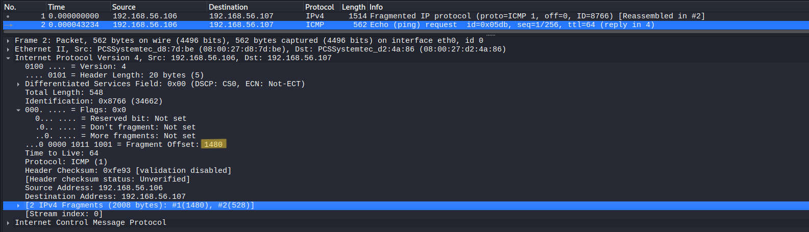

# IP Packet Structure Analysis

## Objective
Analyze the structure of an IPv4 packet and understand key header fields, including fragmentation behavior when packet size exceeds the network MTU.

## Lab Environment
- Kali Linux (traffic generation and packet capture)
- Ubuntu Server (target machine)

## Network Configuration
- Kali Linux : 192.168.56.107
- Ubuntu Server : 192.168.56.106
- Network Type : Host-only network

## Tools Used
- Wireshark (packet capture and analysis)
- ping (to generate traffic)

## Procedure

### Step 1 – Start Packet Capture
Open Wireshark on Kali Linux and start capturing packets on the active network interface.

### Step 2 – Apply Filter
Apply the following filter:

icmp

### Step 3 – Generate Normal Traffic
Run the following command:

ping 192.168.56.106

### Step 4 – Analyze IP Header
Select an ICMP packet and expand the "Internet Protocol Version 4" section.

### Step 5 – Generate Fragmented Traffic
Run the following command to send large packets:

ping -s 2000 192.168.56.106

### Step 6 – Observe Fragmentation
Identify fragmented packets in Wireshark and analyze their fields.

---

## Observation

### IP Header Overview

The IPv4 header contains essential fields required for packet delivery:

- Version indicates IPv4.  
- Header Length specifies the size of the header.  
- Total Length represents the size of the entire packet.  
- TTL (Time To Live) limits the packet lifetime in the network.  
- Protocol field indicates the encapsulated protocol (ICMP).  
- Source and Destination addresses identify the communicating hosts.  

---

### Flags and Fragmentation Fields

- The "Don't Fragment" flag determines whether a packet can be fragmented.  
- The "More Fragments" flag indicates if additional fragments follow.  
- Fragment Offset specifies the position of the fragment within the original packet.  

In normal packets, fragmentation does not occur, and the fragment offset remains zero.

---

### Fragmentation Analysis

When a packet exceeds the Maximum Transmission Unit (MTU), it is divided into smaller fragments.

Observations:

- Multiple packets share the same **Identification** value.  
- Fragment Offset is non-zero, indicating split packets.  
- Packets are reassembled at the destination.  

This behavior was observed when sending large packets using the ping command.

---

### Key Observations

- IP handles logical addressing and routing of packets.  
- TTL prevents packets from looping indefinitely in the network.  
- Fragmentation occurs when packet size exceeds MTU.  
- The Identification field is used to group fragments of the same packet.  

---

## Security Relevance

Manipulation of IP header fields can be used in evasion techniques and fragmentation-based attacks.  
Fragmented packets may be used to bypass detection systems or obscure malicious payloads.  
TTL values can also help identify anomalies and detect suspicious traffic patterns.

---

## Conclusion

The IPv4 header plays a critical role in packet transmission and routing.  
Understanding its fields, along with fragmentation behavior, is essential for analyzing network traffic and detecting anomalies.
