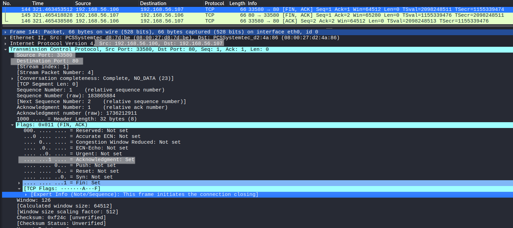
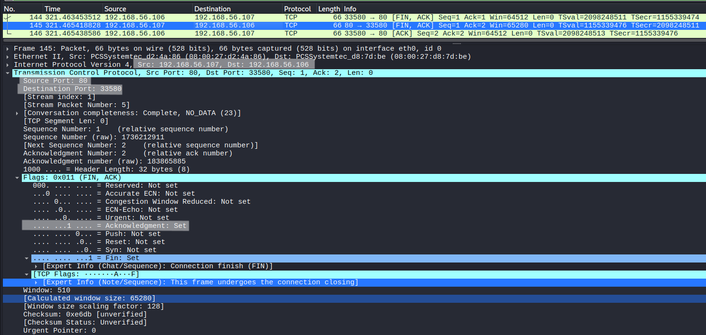
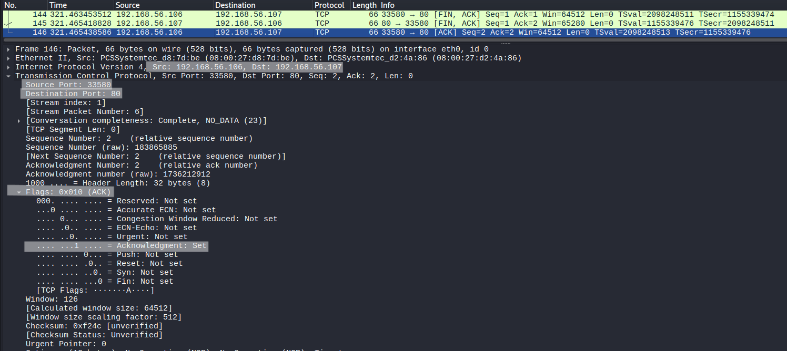
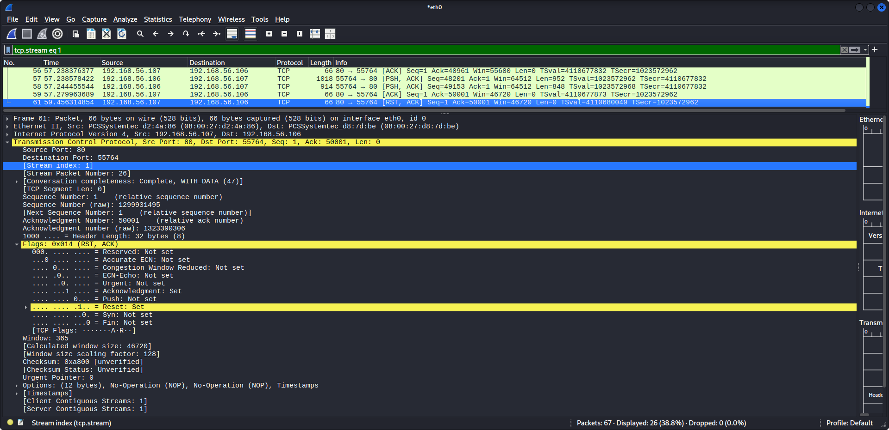

# TCP Connection Termination Analysis

## Objective
Analyze how a TCP connection is terminated and understand how sequence and acknowledgment numbers are used during the termination process.

## Lab Environment
- Kali Linux (traffic generation and packet capture)
- Ubuntu Server (target machine)

## Network Configuration
- Kali Linux : 192.168.56.106
- Ubuntu Server : 192.168.56.107
- Network Type : Host-only network

## Tools Used
- Wireshark (packet capture and analysis)
- curl (to generate TCP traffic)

## Procedure

### Step 1 – Start Packet Capture
Start Wireshark and capture traffic.

### Step 2 – Apply Filter
```
tcp.port == 80
```

### Step 3 – Generate and Close Connection
Run:
```
curl http://192.168.56.107
```

### Step 4 – Identify Termination Packets
Locate FIN and ACK packets at the end of the TCP stream.

---

## Observation

### Client FIN (Connection Termination Initiation)



The client initiates termination.

- Flags: FIN, ACK  
- Sequence number = X  
- Acknowledgment number = Y  

This indicates the client has finished sending data.

---

### Server FIN (Acknowledgment + Termination)



The server responds with a combined FIN and ACK.

- Flags: FIN, ACK  
- Sequence number = Y  
- Acknowledgment number = X + 1  

The server acknowledges the client’s FIN and simultaneously signals its own termination.

---

### Final ACK



The client sends the final acknowledgment.

- Flags: ACK  
- Sequence number = X + 1  
- Acknowledgment number = Y + 1  

This completes the connection termination.

---

### Packet Details


- Sequence Number tracks the byte stream.  
- Acknowledgment Number confirms received data.  
- FIN flag indicates termination request.  
- ACK confirms receipt of FIN.  

---

### Termination Mechanism

In this capture, TCP termination occurred in **three packets**:

- Client → FIN, ACK  
- Server → FIN, ACK  
- Client → ACK  

This happens because the server combines acknowledgment and termination into a single packet, optimizing the process.

---

### Standard vs Observed Behavior

**Standard (4-step termination):**
- Client → FIN  
- Server → ACK  
- Server → FIN  
- Client → ACK  

**Observed (3-step termination):**
- Client → FIN, ACK  
- Server → FIN, ACK  
- Client → ACK  

The difference occurs due to **ACK + FIN combination**, which is common in real-world traffic.


---
### Abrupt Termination (RST)



The TCP connection is terminated abruptly using a Reset (RST) packet.

- Flags: RST, ACK  
- Sequence Number = X  
- Acknowledgment Number = Y  

The RST packet immediately closes the connection without completing the FIN-based termination process.  
Unlike graceful termination, no exchange of FIN and ACK packets occurs.

This indicates that the connection was forcefully terminated, and no further communication is possible between the client and server.

---

## Key Observations

- RST causes immediate termination of the TCP connection  
- No graceful shutdown sequence is followed  
- Any remaining data in transit is discarded  

---

## Conclusion

RST-based termination represents an abrupt closure of a TCP session, where the connection is immediately reset without following the normal termination handshake.

---

### Key Observations

- TCP termination is a bidirectional process.  
- Each side independently closes its connection.  
- Sequence and acknowledgment numbers ensure proper synchronization during closure.  
- FIN consumes one sequence number (similar to SYN).  

---

## Security Relevance

TCP termination patterns can be used to detect abnormal connection behavior, including:

- Half-open connections  
- Reset-based attacks  
- Unusual termination sequences  

---

## Conclusion

TCP connection termination ensures graceful closure of communication using FIN and ACK flags.  
Understanding both standard and optimized termination behavior is essential for accurate traffic analysis.
