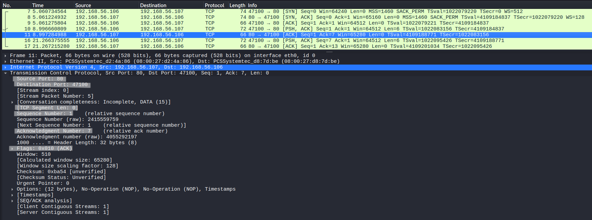
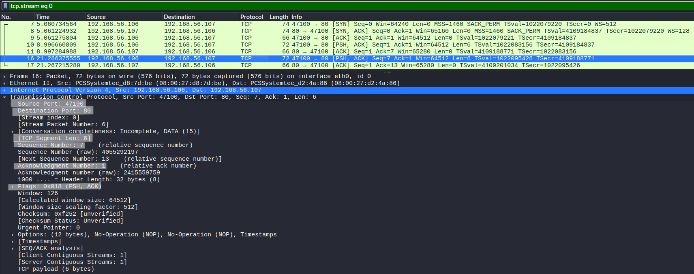
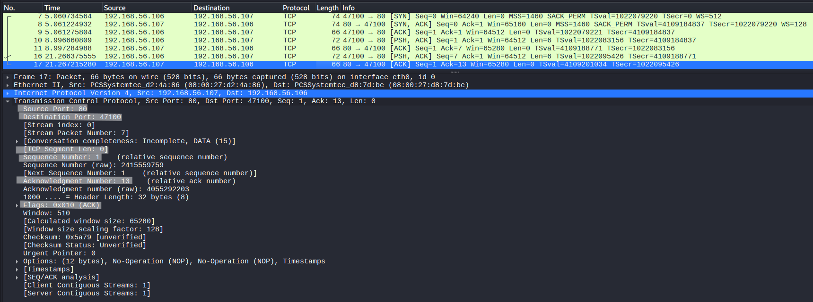

# TCP Data Flow Analysis

## Objective
Analyze how TCP uses sequence and acknowledgment numbers to ensure reliable data transmission at the byte level.

---

## Lab Environment
- Kali Linux (client)
- Ubuntu Server (server)

---

## Network Configuration
- Kali Linux : 192.168.56.106
- Ubuntu Server : 192.168.56.107
- Network Type : Host-only network

---

## Tools Used
- Wireshark (packet capture and analysis)
- netcat (nc)

---

## Procedure

### Step 1 – Start Packet Capture
Start Wireshark on Kali Linux and capture traffic on the active interface.

---

### Step 2 – Apply Filter
Apply the following filter:

```
tcp.port == 80
```

---

### Step 3 – Start Server
On Ubuntu server:

```
nc -lvp 80
```

---

### Step 4 – Establish Connection
On Kali Linux:

```
nc 192.168.56.107 80
```

---

### Step 5 – Send Controlled Data
Type the following (press Enter after each):

```
hello
world
```

---

## Observation

### First Data Packet


The client sends the first segment of data to the server.

- Sequence Number = 1  
- Segment Length = 6 bytes ("hello\n")  
- Flags: PSH, ACK  

The sequence number represents the **starting byte position** of the transmitted data.  
This means the data in this segment begins from byte 1 in the TCP stream.

---

### First Acknowledgment



The server acknowledges the received data.

- Acknowledgment Number = 7  
- Calculation: 1 (SEQ) + 6 (bytes) = 7  
- Flags: ACK  

The acknowledgment number indicates the **next expected byte** from the sender.  
This confirms that all bytes up to byte 6 have been successfully received.

---

### Second Data Packet



The client sends the next segment of data.

- Sequence Number = 7  
- Segment Length = 6 bytes ("world\n")  
- Flags: PSH, ACK  

Since the previous 6 bytes were already transmitted, the sequence number continues from byte 7.  
This demonstrates that TCP maintains a continuous byte stream.

---

### Second Acknowledgment



The server acknowledges the second segment.

- Acknowledgment Number = 13  
- Calculation: 7 + 6 = 13  
- Flags: ACK  

This confirms that all bytes up to byte 12 have been received, and the next expected byte is 13.

---

## Data Flow Mechanism

- TCP transmits data as a continuous stream of bytes  
- Each byte is assigned a sequence number  
- The receiver acknowledges the next expected byte  

From this lab:

- First transmission:
  - SEQ = 1, LEN = 6 → ACK = 7  
- Second transmission:
  - SEQ = 7, LEN = 6 → ACK = 13  

---

## Key Observations

- TCP tracks data at the byte level, not packet level  
- Sequence numbers indicate **where data starts**  
- Acknowledgment numbers indicate **how much data has been received**  
- Reliable communication is achieved through continuous acknowledgment  

---

## Conclusion

TCP ensures reliable and ordered data transmission by tracking each byte using sequence numbers and confirming delivery through acknowledgment numbers.  
This mechanism guarantees that no data is lost or received out of order.
