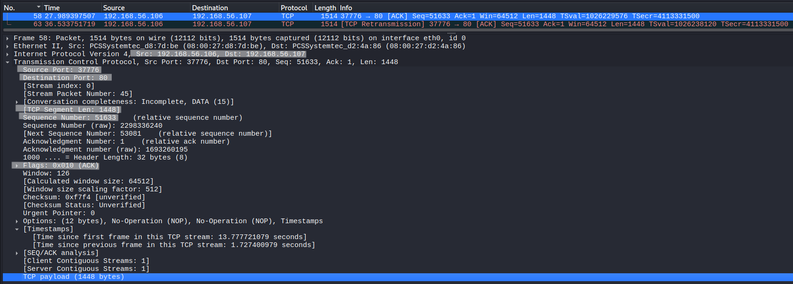
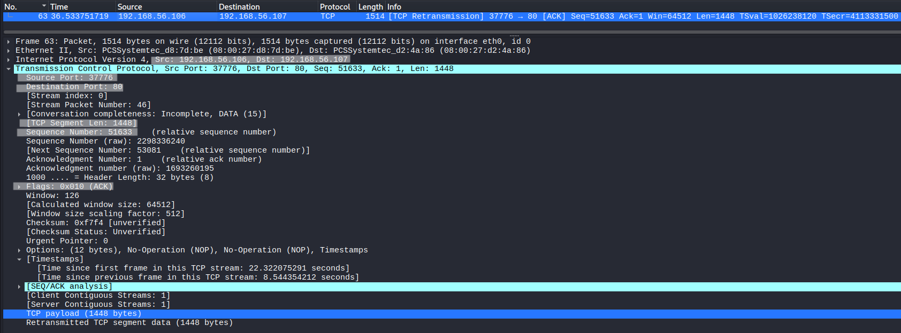

# TCP Retransmission Analysis

## Objective
Analyze how TCP detects packet loss and retransmits data using sequence numbers and acknowledgments.

---

## Lab Environment
- Kali Linux (client)
- Ubuntu Server (server)

---

## Network Configuration
- Kali Linux : 192.168.56.106
- Ubuntu Server : 192.168.56.107
- Network Type : Host-only network

---

## Tools Used
- Wireshark (packet capture and analysis)
- netcat (nc)

---

## Procedure

### Step 1 – Start Packet Capture
Start Wireshark on Kali Linux and capture traffic.

---

### Step 2 – Apply Filter
```
tcp.port == 80
```

---

### Step 3 – Introduce Packet Loss
```
sudo tc qdisc add dev eth0 root netem loss 40%
```

---

### Step 4 – Start Server
```
nc -lvp 80
```

---

### Step 5 – Establish Connection
```
nc 192.168.56.107 80
```

---

### Step 6 – Send Continuous Data
```
yes A | nc 192.168.56.107 80
```

---

### Step 7 – Analyze Retransmission
Apply filter:
```
tcp.analysis.retransmission
```

---

## Observation

### Original Packet



The client sends a data segment to the server.

- Sequence Number = 51633  
- Segment Length = 1448  
- Flags: PSH, ACK  

This represents the initial transmission of data.

---

### Retransmitted Packet



The same data segment is transmitted again.

- Sequence Number = 51633  
- Segment Length = 1448  
- Flags: PSH, ACK  
- Marked as: [TCP Retransmission]  

This occurs because the sender did not receive an acknowledgment for the original packet.

---

## Retransmission Mechanism

- TCP sends data and waits for acknowledgment  
- If acknowledgment is not received  
- Receiver sends duplicate ACKs  
- Sender detects missing data  
- The same segment is retransmitted  

---

## Key Observations

- Retransmitted packets have identical sequence numbers  
- Duplicate ACKs indicate missing segments  
- Retransmission ensures reliable delivery  
- TCP automatically recovers from packet loss  

---

## Conclusion

TCP retransmission is a reliability mechanism that ensures data delivery even in the presence of packet loss.  
By resending unacknowledged data segments, TCP maintains integrity and correct ordering of communication.
