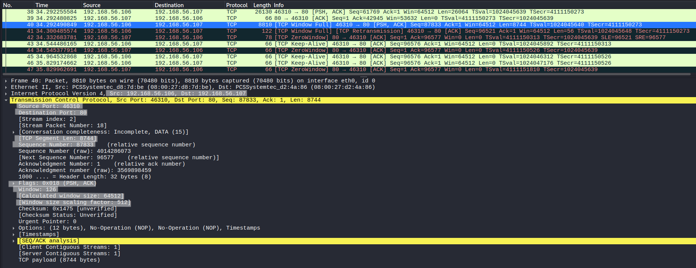
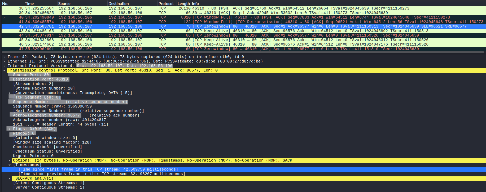
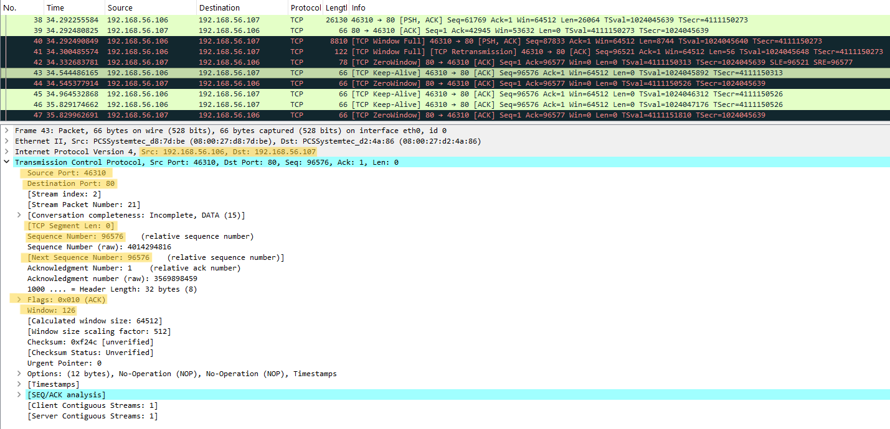

# TCP Flow Control Analysis

## Objective
Analyze how TCP uses the window mechanism to control data flow and prevent receiver overload.

---

## Lab Environment
- Kali Linux (client)
- Ubuntu Server (server)

---

## Network Configuration
- Kali Linux : 192.168.56.106
- Ubuntu Server : 192.168.56.107
- Network Type : Host-only network

---

## Tools Used
- Wireshark (packet capture and analysis)
- netcat (nc)

---

## Procedure

### Step 1 – Start Packet Capture
Start Wireshark on Kali Linux and capture traffic.

---

### Step 2 – Apply Filter
```
tcp.port == 80
```

---

### Step 3 – Establish Connection
```
nc -lvp 80
nc 192.168.56.107 80
```

---

### Step 4 – Generate Continuous Data
```
yes A | nc 192.168.56.107 80
```

---

### Step 5 – Observe Flow Control Behavior
Monitor packets where the receiver limits data flow.

---

## Observation

### TCP Window Full



The receiver indicates that its buffer is nearly full.

- Window size is reduced  
- Sender must slow down transmission  

This prevents the receiver from being overwhelmed by incoming data.

---

### TCP Zero Window



The receiver advertises a window size of zero.

- Window size = 0  
- Sender must stop sending data  

This indicates that the receiver cannot accept any more data until buffer space is available.

---

### TCP Keep-Alive



The client sends keep-alive packets when the connection remains idle due to a zero window condition.

- No actual data is transmitted  
- Used to check if the connection is still active  

This occurs because the sender cannot transmit data while the receiver advertises a zero window.

---

## Flow Control Mechanism

- TCP uses a sliding window mechanism  
- Receiver advertises available buffer size  
- Sender adjusts transmission rate accordingly  

If:

- Window decreases → sender slows down  
- Window becomes zero → sender stops  
- Window increases → sender resumes  

---

## Key Observations

- Flow control prevents receiver overload  
- TCP dynamically adjusts data transmission  
- Window size directly controls sender behavior  

---

## Conclusion

TCP flow control ensures efficient data transmission by allowing the receiver to regulate how much data can be sent.  
This mechanism prevents buffer overflow and maintains stable communication between hosts.
