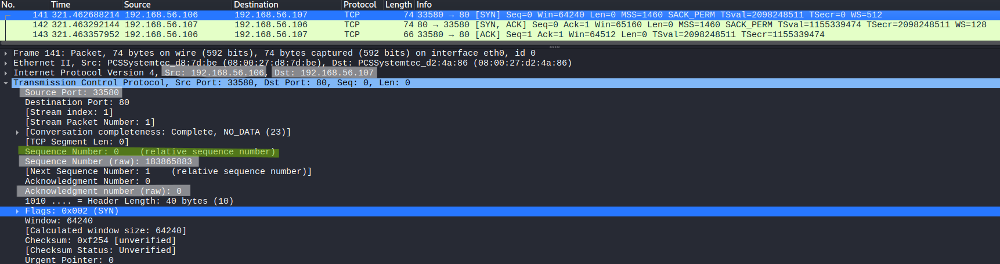
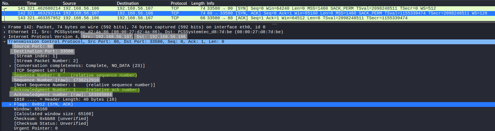
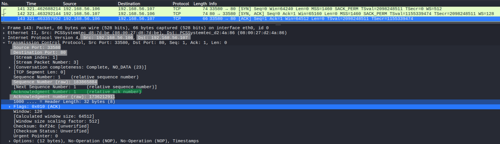
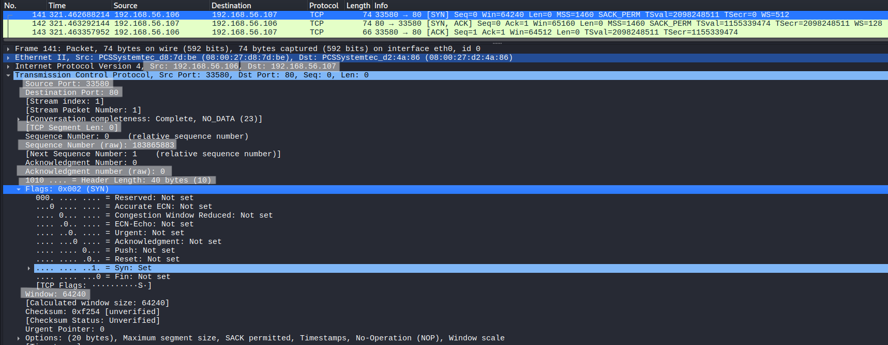

# TCP Three-Way Handshake Analysis

## Objective
Analyze the TCP three-way handshake and understand how sequence and acknowledgment numbers establish a reliable connection.

## Lab Environment
- Kali Linux (traffic generation and packet capture)
- Ubuntu Server (target machine)

## Network Configuration
- Kali Linux : 192.168.56.106
- Ubuntu Server : 192.168.56.107
- Network Type : Host-only network

## Tools Used
- Wireshark (packet capture and analysis)
- curl (to generate TCP traffic)

## Procedure

### Step 1 – Start Packet Capture
Start Wireshark on Kali Linux and capture traffic.

### Step 2 – Apply Filter
```
tcp.port == 80
```

### Step 3 – Generate Traffic
```
curl http://192.168.56.107
```

### Step 4 – Identify Handshake
Locate SYN, SYN-ACK, and ACK packets.

---

## Observation

### SYN Packet



The client initiates the connection.

- Sequence number = 0 (relative)
- SYN flag is set
- No acknowledgment number

---

### SYN-ACK Packet



The server responds to the SYN request.

- Sequence number = 0 (server initial sequence)
- Acknowledgment number = 1 (client seq + 1)
- SYN and ACK flags are set

---

### ACK Packet



The client completes the handshake.

- Sequence number = 1
- Acknowledgment number = 1 (server seq + 1)
- ACK flag is set

---

### Packet Details



Key fields observed:

- Source Port: 33580  
- Destination Port: 80  
- Sequence Number: tracks byte position  
- Acknowledgment Number: confirms received data  
- Window Size: defines buffer size for receiving data  

---

### Sequence and Acknowledgment Mechanism

- Client starts with sequence number = 0  
- Server acknowledges with ACK = 1  
- Server sends its own sequence number = 0  
- Client acknowledges with ACK = 1  

Each SYN consumes **one sequence number**, which is why acknowledgment = sequence + 1.

---

### Relative vs Raw Sequence Numbers

- **Relative sequence numbers** are normalized by Wireshark to start from 0 for easier analysis.  
- **Raw sequence numbers** are the actual 32-bit values used in TCP communication.  

Example:
- Raw: 183865883  
- Relative: 0  

Relative values are used for readability, while raw values represent real network data.

---

### Key Observations

- TCP establishes a connection using a three-step handshake.  
- Sequence and acknowledgment numbers synchronize communication.  
- The connection becomes stateful after the handshake.  

---

## Security Relevance

TCP handshake analysis helps detect:

- SYN flood attacks  
- Port scanning behavior  
- Abnormal connection attempts  

---

## Conclusion

The TCP three-way handshake ensures reliable connection establishment using sequence and acknowledgment numbers.  
Understanding this mechanism is essential for analyzing network traffic and detecting anomalies.
