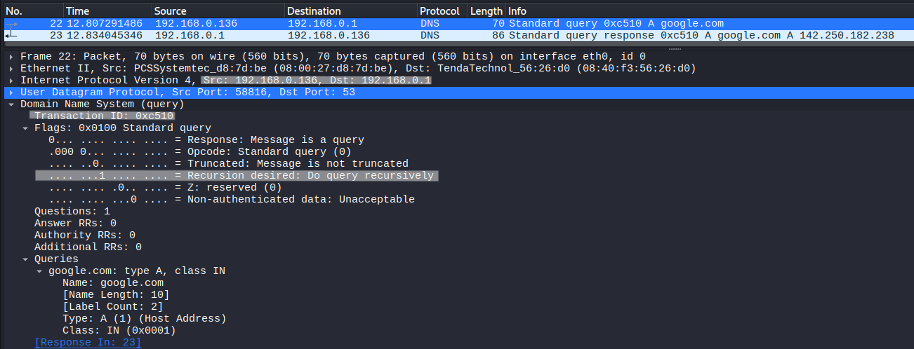
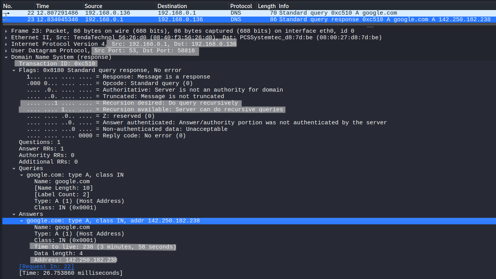

# DNS Query and Response Analysis

## Objective
Analyze DNS query and response behavior and understand how domain names are resolved.

---

## Lab Environment
- Kali Linux (client)
- Router (DNS Server)

---

## Network Configuration
- Kali Linux IP : 192.168.0.136  
- DNS Server IP : 192.168.0.1  
- Protocol: UDP  
- Port: 53 (DNS)

---

## Tools Used
- Wireshark
- nslookup

---

## Procedure

### Step 1 – Start Packet Capture
Start Wireshark and capture traffic.

---

### Step 2 – Apply Filter
```
udp.port == 53
```

---

### Step 3 – Generate DNS Query
```
nslookup google.com
```

---

### Step 4 – Analyze Packets
Observe DNS query and response.

---

## Observation

### DNS Query



The client sends a DNS query to resolve the domain name.

- Source IP = 192.168.0.136  
- Destination IP = 192.168.0.1  
- Transaction ID = 0xc510  
- Query Name = google.com  
- Type = A  
- Flags:
  - Recursion Desired (RD) = 1  

The client requests recursive resolution from the DNS server.

---

### DNS Response



The DNS server responds with the resolved IP address.

- Source IP = 192.168.0.1  
- Destination IP = 192.168.0.136  
- Transaction ID = 0xc510 (matches query)  
- Answer: 142.250.182.238  
- Time To Live (TTL) = 238 seconds  
- Flags:
  - Recursion Available (RA) = 1  

The matching transaction ID confirms that this response corresponds to the original query.

---

## TTL (Time To Live)

- TTL defines how long the DNS response can be cached  
- In this case, TTL = 238 seconds  

This means the DNS server or client can store this IP address for **238 seconds** before requesting it again.

After TTL expires:
- The cached entry is removed  
- A new DNS query must be sent  

---

## Key Observations

- DNS uses Transaction ID to match query and response  
- Query and response are carried over UDP  
- Recursion Desired (RD) indicates client request for recursive resolution  
- Recursion Available (RA) indicates server capability  
- TTL controls how long DNS responses are cached  

---

## Conclusion

DNS resolves domain names into IP addresses using a query-response mechanism over UDP.  
Transaction IDs ensure correct matching, while TTL optimizes performance by allowing temporary caching of results.
