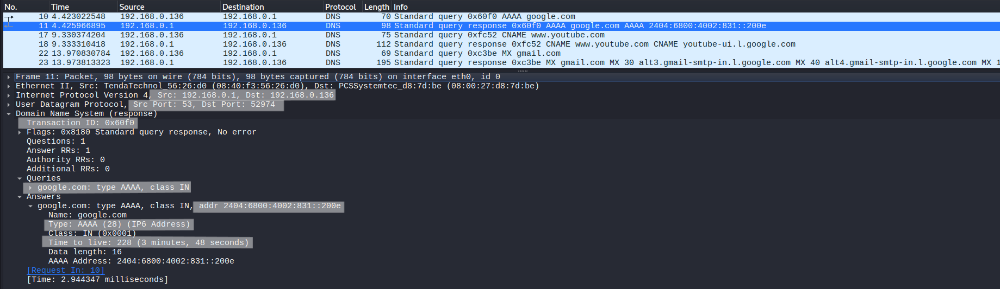
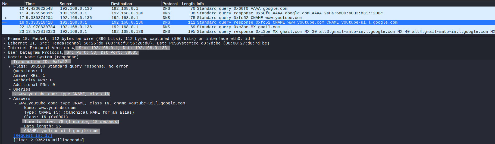
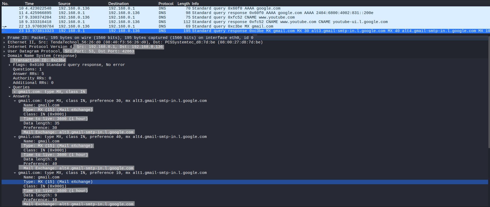

# DNS Record Types Analysis

## Objective
Analyze different DNS record types and understand how domain names are mapped to various resources through real packet-level inspection.

---

## Lab Environment
- Kali Linux (Client)
- Local Router acting as DNS Forwarder (192.168.0.1)

---

## Network Configuration
- Protocol: UDP
- Port: 53 (DNS)

---

## Tools Used
- Wireshark
- nslookup

---

## Procedure

### Step 1 – Start Packet Capture
Start Wireshark and begin capturing on the active network interface.

---

### Step 2 – Apply Filter
```
udp.port == 53
```

---

### Step 3 – Generate DNS Queries

```
nslookup -type=AAAA google.com
nslookup -type=CNAME www.youtube.com
nslookup -type=MX gmail.com
```

---

### Step 4 – Analyze Responses
Inspect DNS query and response packets in Wireshark and analyze record types, response structure, and values.

---

## Common DNS Record Types

- **A** → Maps domain to IPv4 address  
- **AAAA** → Maps domain to IPv6 address  
- **CNAME** → Alias to another domain  
- **MX** → Mail server for the domain  
- **NS** → Name server for the domain  
- **TXT** → Stores text data (SPF, verification, etc.)  
- **SOA** → Start of authority (zone information)  

---

## Detailed Observations & Analysis

### 1. AAAA Record (IPv6 Resolution)



- Query Domain: `google.com`
- Record Type: AAAA
- Response IPv6 Address: `2404:6800:4002:831::200e`
- Source (DNS Server): `192.168.0.1`
- Destination (Client): `192.168.0.136`
- Protocol: UDP
- TTL: 228 seconds

#### Analysis:
- The AAAA record maps the domain `google.com` to an IPv6 address, confirming IPv6 support.
- The response is received from the local DNS server (router), indicating recursive resolution.
- The IPv6 address belongs to Google's infrastructure and follows standard IPv6 formatting.
- TTL value (228 seconds) indicates the duration for which this record can be cached locally.
- Packet flow observed:
  - Client sends query to DNS server
  - DNS server responds with resolved IPv6 address

---

### 2. CNAME Record (Alias Resolution)



- Query Domain: `www.youtube.com`
- Record Type: CNAME
- Canonical Name: `youtube-ui.l.google.com`
- Source (DNS Server): `192.168.0.1`
- TTL: 78 seconds

#### Analysis:
- The queried domain does not resolve directly to an IP address.
- Instead, it returns a CNAME (alias) pointing to another domain:
  youtube-ui.l.google.com
- This shows that `www.youtube.com` is an alias managed under Google's domain infrastructure.
- The relatively low TTL (78 seconds) suggests dynamic resolution, commonly used in large-scale distributed services.
- CNAME records are typically followed by additional DNS queries to resolve the final IP.

---

### 3. MX Record (Mail Server Resolution)



- Query Domain: `gmail.com`
- Record Type: MX
- Number of Answers: Multiple (5 records observed)
- Mail Servers Identified:
  - alt1.gmail-smtp-in.l.google.com (Preference: 10)
  - alt2.gmail-smtp-in.l.google.com (Preference: 20)
  - alt3.gmail-smtp-in.l.google.com (Preference: 30)
  - alt4.gmail-smtp-in.l.google.com (Preference: 40)
- TTL: 3600 seconds (1 hour)

#### Analysis:
- MX records define the mail exchange servers responsible for handling email for a domain.
- Multiple MX records are returned, each with a priority value (preference):
  - Lower value = higher priority
- Example:
  - Preference 10 → highest priority server
  - Preference 40 → fallback server
- This setup ensures load distribution and redundancy in case of server failure.
- TTL is higher (3600 sec), indicating mail infrastructure is relatively stable.

---

## Note

- The **A record** was already analyzed in the DNS Query and Response lab  
- Other record types such as NS, TXT, and SOA are not included in packet analysis to keep the lab focused and concise  

---

## Key Observations

- DNS queries are handled by the local router (192.168.0.1) acting as a DNS forwarder  
- Different record types return different kinds of data:
  - AAAA → IPv6 address  
  - CNAME → Alias mapping  
  - MX → Mail server infrastructure  
- TTL values vary depending on the use case:
  - Lower TTL → dynamic services  
  - Higher TTL → stable infrastructure  
- Some domains (like YouTube) do not directly resolve to IP and require additional resolution steps  

---

## Conclusion

DNS resolution involves multiple record types, each serving a specific role in mapping domain names to services.  
Through packet-level analysis using Wireshark, it is possible to observe how queries are processed, how responses are structured, and how modern internet services rely on layered DNS mechanisms such as aliasing and distributed mail systems.
