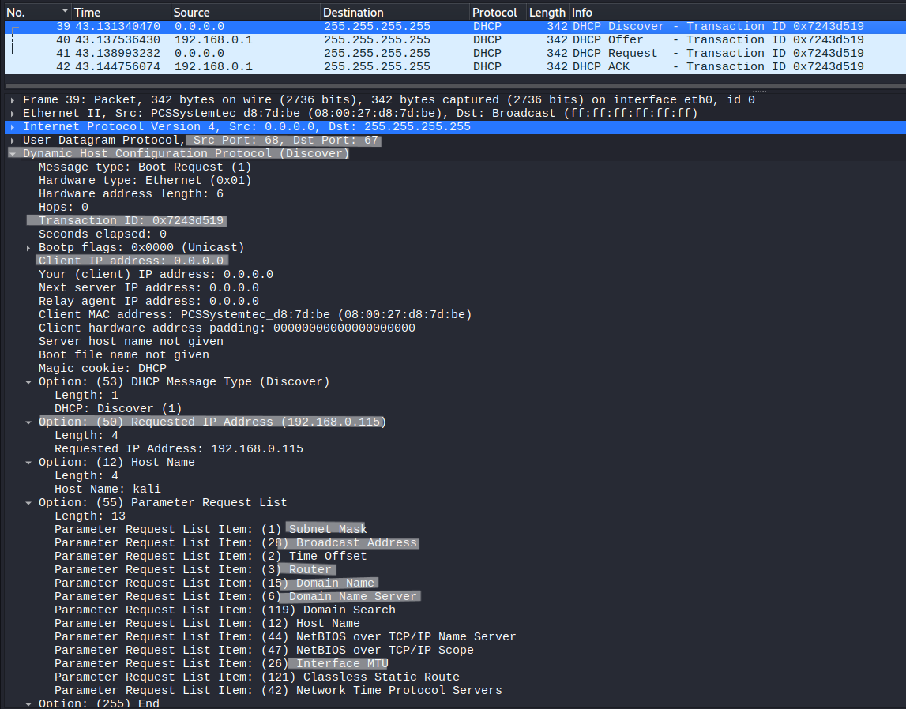
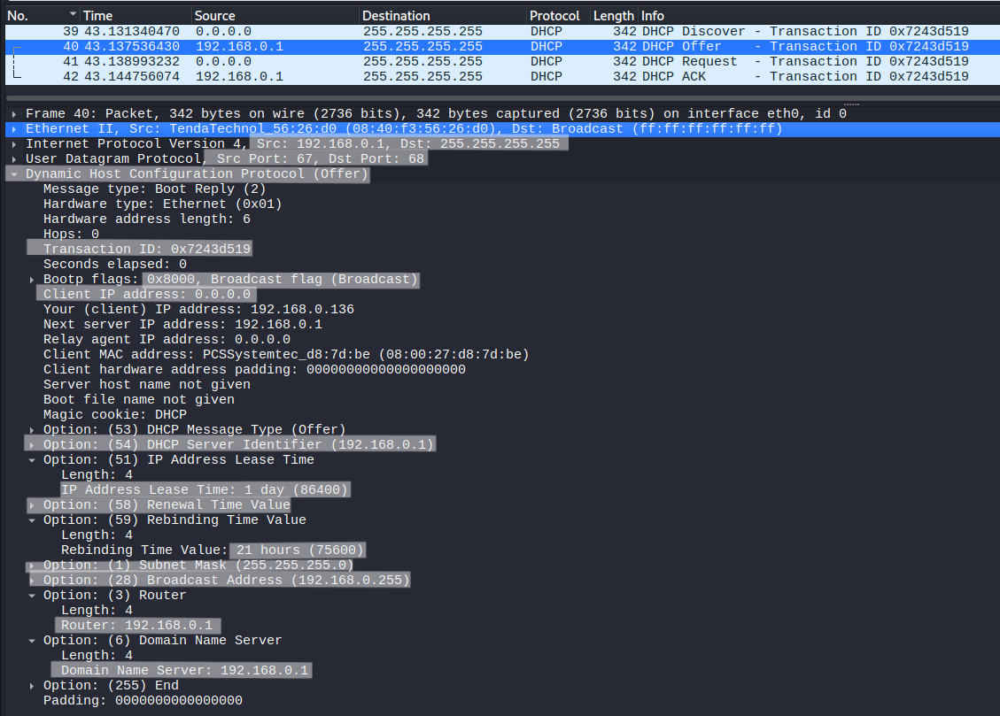
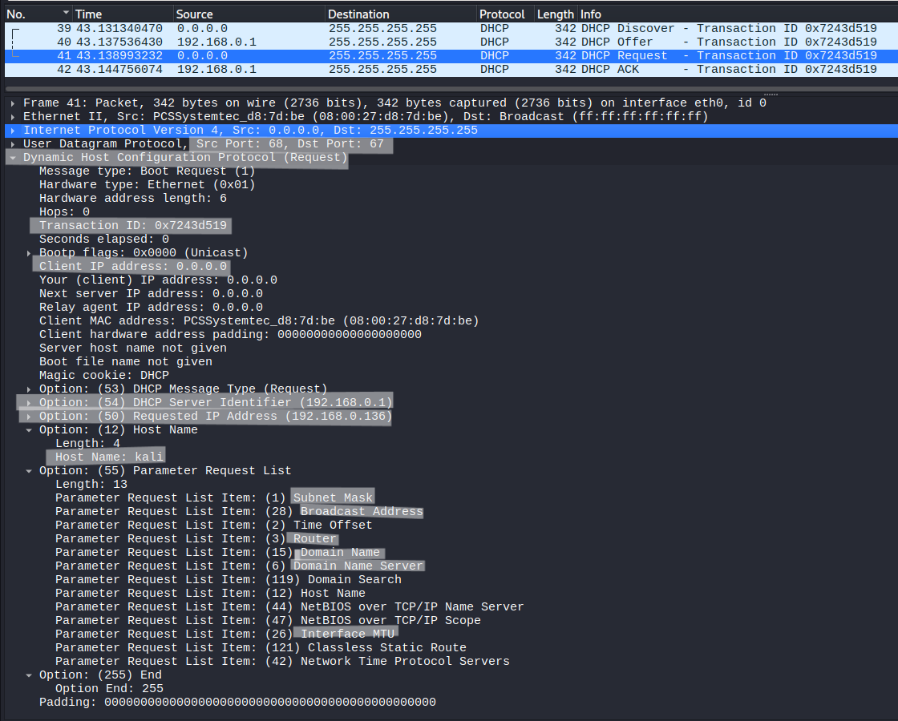
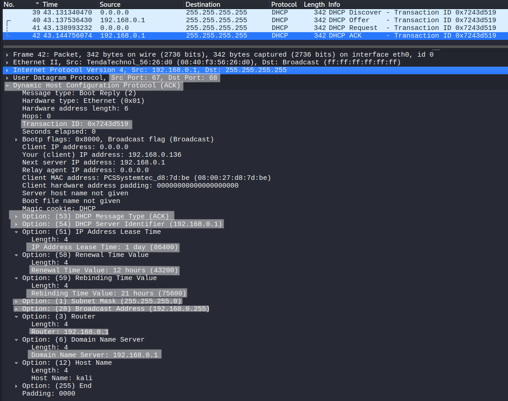

# DHCP DORA Process Analysis

## Objective
Analyze the DHCP process and understand how IP address assignment and network configuration are negotiated between client and server.

---

## Lab Environment
- Kali Linux (client)
- Router (DHCP Server)

---

## Network Configuration
- Initial Client IP : 0.0.0.0  
- Broadcast Address : 255.255.255.255  
- DHCP Server IP : 192.168.0.1 (router) 

---

## Tools Used
- Wireshark
- dhclient

---

## Procedure

### Step 1 – Start Packet Capture
Start Wireshark and capture traffic.

---

### Step 2 – Apply Filter
```
bootp
```

---

### Step 3 – Release and Renew IP
```
sudo dhclient -r eth0
sudo dhclient -v eth0
```

---

## Observation

### DHCP Discover



- Transaction ID : 0x7243d519
- Source IP: 0.0.0.0  
- Destination IP: 255.255.255.255  
- Requested IP Address:192.168.0.115   

The client does not have an IP address, so it uses **0.0.0.0** and broadcasts the request to locate DHCP servers.  
The requested IP indicates a previously used or preferred address.

---

### DHCP Offer



- Transaction ID : 0x7243d519
- Offered IP Address:192.168.0.136
- DHCP Server Identifier: 192.168.0.1 
- IP Address Lease Time: 1 day
- Rebinding Time (T1): 21 hours  

Configuration provided:

- Subnet Mask: 255.255.255.0 
- Broadcast Address:192.168.0.255  
- Router (Default Gateway):192.168.0.1  
- Domain Name Server (DNS): 192.168.0.1  

The server selects an available IP and proposes configuration parameters.  
If the requested IP is not available, a different IP is offered.

---

### DHCP Request



- Transaction ID : 0x7243d519
- Requested IP Address: 192.168.0.136  

The client accepts the offered IP and sends a request confirming its selection.

Requested configuration parameters include:

- Subnet Mask  
- Broadcast Address  
- Router (Default Gateway)  
- Domain Name Server (DNS)  
- Host Name  
- Time Offset / NTP Servers  
- Interface MTU  
- NetBIOS Settings  
- Classless Static Routes  

This shows that DHCP is used for complete network configuration, not just IP assignment.

---

### DHCP Acknowledgment (ACK)



- Transaction ID : 0x7243d519
- Assigned IP Address: 192.168.0.136  
- DHCP Server Identifier: 192.168.0.1  
- IP Address Lease Time: 24 Hours 
- Renewal Time (T1): 12 Hours  
- Rebinding Time (T2): 21 Hours  

Configuration confirmed:

- Subnet Mask: 255.255.255.0 
- Broadcast Address: 192.168.0.255  
- Router (Default Gateway): 192.168.0.1  
- Domain Name Server (DNS): 192.168.0.1 
- Host Name: kali  

The ACK finalizes the process and assigns the IP along with all required network parameters.

---

## Key Observations

- DHCP communication starts with broadcast due to lack of initial IP  
- The client may request a specific IP, but the server determines final allocation  
- The Offer and ACK packets contain full configuration details  
- Lease time and renewal timers control IP usage duration  

---

## Conclusion

DHCP dynamically assigns IP addresses and network configuration through a negotiation process.  
The client initiates communication without an IP using broadcast, and the server provides both addressing and configuration parameters required for network connectivity.
