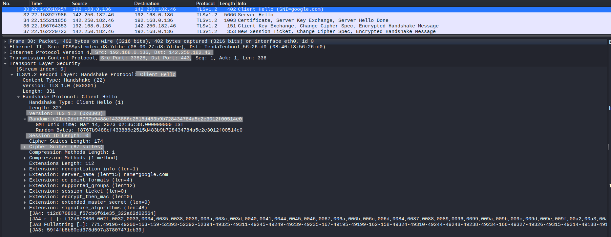
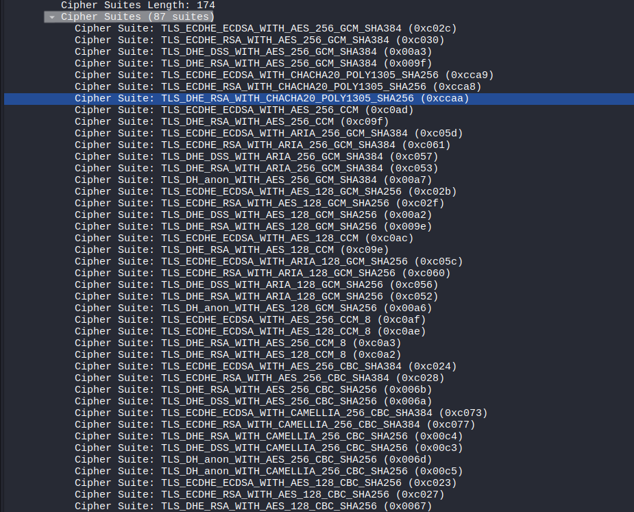
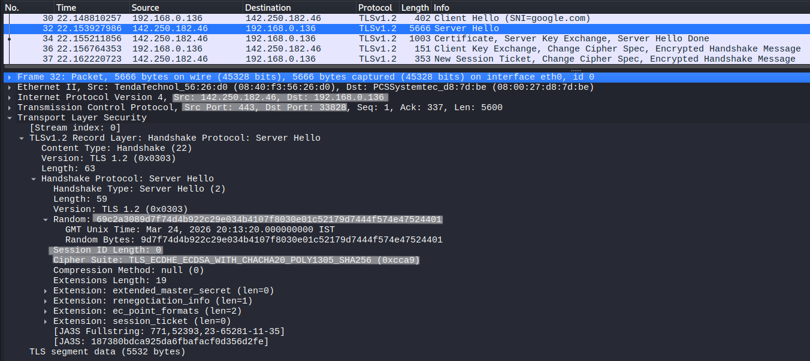
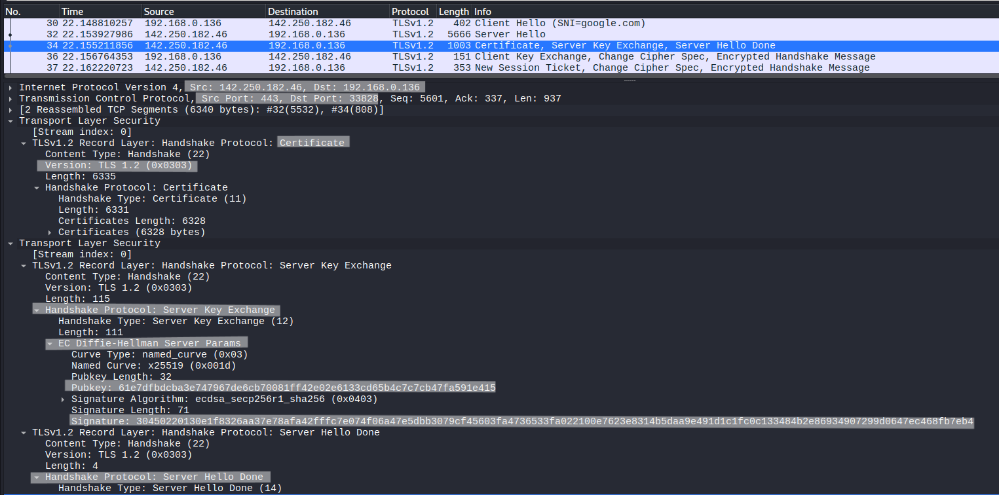
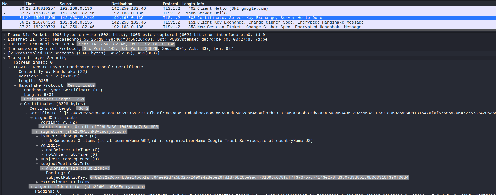
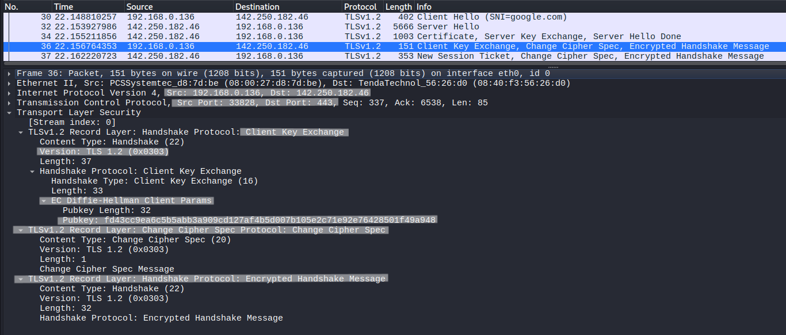
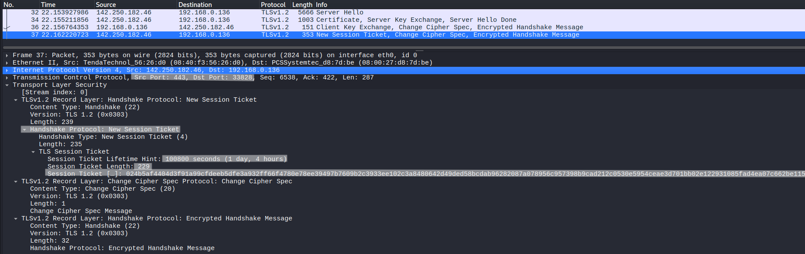

# TLS 1.2 Handshake Analysis (Field-Level)

## Objective
Analyze the TLS 1.2 handshake at packet and field level, and understand how cryptographic parameters are negotiated and used to establish secure communication.

---

## Lab Environment
- Kali Linux (client)
- External HTTPS Server

---

## Network Configuration
- Protocol: TLS 1.2 over TCP
- Port: 443

---

## Tools Used
- Wireshark
- OpenSSL

---

## Procedure

### Step 1 – Start Packet Capture
Start Wireshark and capture traffic.

---

### Step 2 – Apply Filter
```
tls
```

---

### Step 3 – Generate TLS 1.2 Traffic
```
openssl s_client -connect google.com:443 -tls1_2
```

---

## Observation

### Packet 1 – Client Hello



Fields:

- Version: TLS 1.2  
  → TLS version supported by client  

- Random:c21cc2def8767b9488cf433886e2515d483b9b728434784a5e2e3012f00514e0
  → Client random value used in key generation  
 
- Cipher Suites:   
  → List of encryption algorithms supported by client (total 87)  

- Compression Methods: 1 method
  → null (no compression)  

- Extensions: optional features

- Session ID Length: 0  

The session ID is empty, indicating that session resumption via session ID is not used.  
Instead, TLS session tickets are used, as observed in later packets.
Analysis:

The client initiates the handshake by proposing:
- Supported TLS version  
- Cryptographic algorithms  
- Random value for key derivation  


---
#### Supported Cipher Suites



- Client supports total 87 cipher suites
- This screenshot show 40+ only as showing 87 in this lab is not concise  
- The server selects one of these during handshake  

---

### Packet 2 – Server Hello



Fields:

- Version: TLS 1.2  
  → Must match or be compatible with client  

- Random:69c2a3089d7f74d4b922c29e034b4107f8030e01c52179d7444f574e47524401   
  → Server random value 
 
- Selected Cipher:TLS_ECDHE_ECDSA_WITH_CHACHA20_POLY1305_SHA256 (0xcca9)
  → Chosen from client’s offered list 
- Session length : 0  

Analysis:

The server selects:
- TLS version  
- Cipher suite  

✔ Verify:
- Selected cipher suite exists in Client Hello  
- Version compatibility  

---

### Packet 3 – Server Messages  
(Certificate + Server Key Exchange + Server Hello Done)



#### Server Key Exchange

Fields:

- Key Exchange Algorithm: EC Diffie-Hellman Server Params 

Analysis:

Provides parameters required for secure key exchange.

---

#### Certificate Details



- Subject:rdnSequence: 1 item (id-at-commonName=*.google.com)  
- Issuer: rdnSequence: 3 items (id-at-commonName=WR2,id-at-organizationName=Google Trust Services,id-at-countryName=US) 
- Validity: not before: utc time , not after utc time  

The TLS certificate message contains a **certificate chain**, which may include multiple certificates such as:

- Server Certificate  
- Intermediate Certificate(s)  
- Root Certificate  

In this analysis, only the **server certificate** is shown for clarity, as displaying the full chain in a single screenshot is not practical.

The server certificate is sufficient to verify:
- Domain identity (Subject)  
- Certificate authority (Issuer)  
- Validity period  

The remaining certificates in the chain are used to establish a trust path to a trusted root authority.

#### Server Hello Done

→ Indicates server has finished sending handshake messages.

---

### Packet 4 – Client Messages  
(Client Key Exchange + Change Cipher Spec + Finished)



#### Client Key Exchange

Fields:

- Pre-Master Secret (encrypted):fd43cc9ea6c5b5abb3a909cd127af4b5d007b105e2c71e92e76428501f49a948

Analysis:

Client generates pre-master secret and encrypts it using server’s public key.

---

#### Change Cipher Spec

→ Signals that client will switch to encrypted communication.

---

#### Finished

- First encrypted message  
- Confirms integrity of handshake  

✔ Encryption STARTS after this point

---

### Packet 5 – Server Messages  
(New Session Ticket + Change Cipher Spec + Finished)



#### New Session Ticket

Fields:

- Session Ticket:024b5af4404d3f91a99cfdeeb5dfe3a932ff66f4780e78ee39497b7609b2c3933ee102c3a8480642d49ded58bcdab96282087a078956c957398b9cad212c0530e5954ceae3d701bb02e122931085fad4ea07c662be1153bb4f009308c54c72ee92c027aac857b442adfc7a1a6

Analysis:

Allows session resumption without full handshake.
- New Session Ticket: Present  
This indicates that the server uses session tickets for session resumption instead of session IDs.
---

#### Change Cipher Spec

→ Server switches to encrypted communication.

---

#### Finished

Analysis:

Confirms successful handshake from server side.

---

## Cross-Packet Analysis

- Client Random: c21cc2def8767b9488cf433886e2515d483b9b728434784a5e2e3012f00514e0  
- Server Random: 69c2a3089d7f74d4b922c29e034b4107f8030e01c52179d7444f574e47524401  

These values are used together to derive session keys.

---


---

## Key Observations

- TLS handshake negotiates security parameters before data exchange  
- Client and server contribute random values for key generation  
- Certificate ensures authenticity of the server  
- Encryption ensures confidentiality of communication  
- Integrity is ensured using hashing algorithms (e.g., HMAC), which verify that data has not been modified  
- TLS uses both symmetric and asymmetric cryptography    
- Encryption begins after Change Cipher Spec  
- Multiple handshake messages can be grouped in a single TCP segment  

---

## Note

- TLS uses asymmetric cryptography during the handshake to securely exchange key material  
- After key exchange, symmetric encryption is used for data transmission due to better performance  

---

## Conclusion

TLS 1.2 establishes secure communication through structured message exchange and key negotiation.  
Field-level analysis reveals how cryptographic parameters are selected and how both parties derive shared keys for encryption.
