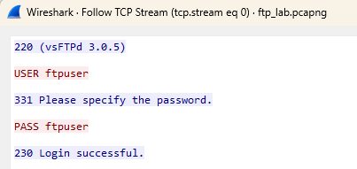
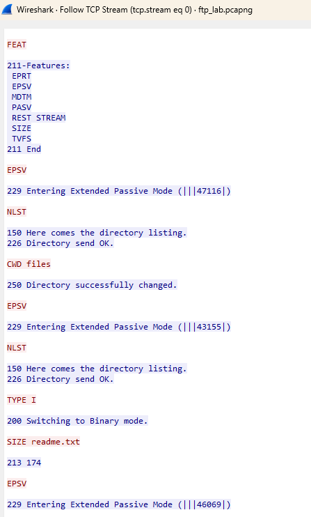
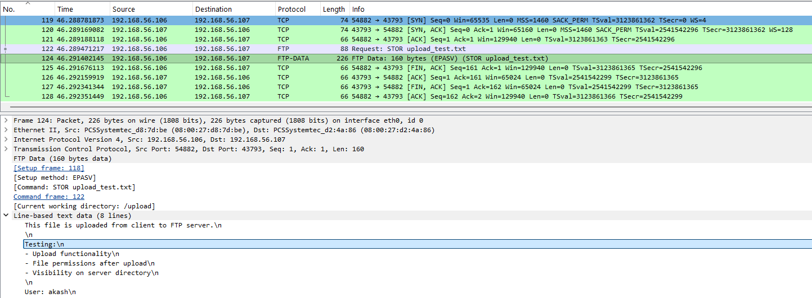

# FTP Protocol Analysis

## Objective
Analyze FTP communication at packet level to understand authentication, command exchange, and file transfer using control and data channels.

---

## Lab Environment
- Kali Linux (Client)
- Ubuntu Server (FTP Server - vsftpd)

---

## Network Configuration
- Client IP: 192.168.56.106 
- Server IP: 192.168.56.107
- Protocol: FTP  
- Control Port: 21  

---

## Tools Used
- Wireshark  
- FTP client  

---

## Procedure

### Step 1 – Start FTP Server
Ensure FTP service is running on Ubuntu server.

---

### Step 2 – Start Packet Capture
Start Wireshark on Kali Linux.

---

### Step 3 – Apply Filter
```
ftp || tcp
```

---

### Step 4 – Connect to FTP Server
```
ftp <server-ip>
```

---

### Step 5 – Authenticate
Enter username and password.

---

### Step 6 – Execute Commands
```
pwd
ls
cd files
```

---

### Step 7 – Download File
```
get readme.txt
```

---

### Step 8 – Upload File
```
put upload_test.txt
```

---

## Observation

---

### 1. FTP Authentication (Control Channel)



- USER ftpuser → username sent in plaintext  
- PASS ftpuser → password sent in plaintext  
- Server responds with login status  

**Analysis:**

FTP transmits credentials without encryption, making it vulnerable to interception.

---

### 2. FTP Command Exchange



Observed commands:

- SYST → system information  
- FEAT → supported features  
- EPSV → request passive data connection  
- NLST → directory listing  
- CWD → change directory  
- TYPE I → binary transfer mode  

**Analysis:**

- Commands are exchanged over control channel (port 21)  
- Server responds with status codes  
- EPSV is used to establish data channel  

---

### 3. FTP Data Channel (Download - RETR)


- Packets show TCP 3-way handshake (SYN, SYN-ACK, ACK)  
- Separate port used for data transfer  
- FTP Data packet contains file content in plaintext  
- Connection terminated using FIN, ACK  

**Analysis:**

- FTP creates a new TCP connection for each data transfer  
- File content is transmitted without encryption  
- Control and data channels are separated  

---

### 4. FTP Data Channel (Upload - STOR)



- STOR command initiates upload  
- Separate TCP connection established  
- File content sent from client to server  
- Connection closed after transfer  

**Analysis:**

- Upload uses same mechanism as download  
- Data is transmitted in plaintext  
- Each transfer creates a new connection  

---

## Data Channel Behavior

- FTP uses two channels:
  - Control Channel → commands (port 21)  
  - Data Channel → file transfer (dynamic ports)  

- Each data transfer:
  - Creates a new TCP connection  
  - Uses separate ports  
  - Closes after completion  

- Multiple TCP handshakes occur during one session  

---
### Active vs Passive Mode

- **Active Mode:**  
  The client provides a port, and the server initiates the data connection back to the client.  
  This can be blocked by client-side firewalls.

- **Passive Mode (PASV/EPSV):**  
  The server provides a port, and the client initiates the data connection.  
  This is firewall-friendly and commonly used.

  ---

## Common FTP Commands Observed

- USER → sends username  
- PASS → sends password  
- PWD → print working directory  
- CWD → change directory  
- LIST / NLST → list files  
- EPSV → request passive data connection  
- RETR → download file  
- STOR → upload file  
- TYPE → set transfer mode  

---

## Security Analysis

- Credentials (username/password) are visible in plaintext  
- File contents are visible in packet capture  
- No encryption is used in FTP  

---

## Note

FTP supports additional commands such as:
- MGET / MPUT → multiple file transfer  
- RMD / DELE → remove files/directories  

These commands were not executed in this lab because:
- They use the same underlying data channel mechanism  
- They do not introduce new protocol behavior  
- Including them would add redundancy without improving analysis  

---

## Why Full Packet Capture is Not Shown

Wireshark captures a large number of packets during FTP communication.  
Displaying all packets is not practical and does not improve understanding.

Instead, selected packets are shown to:
- Highlight key protocol behavior  
- Demonstrate control and data channel separation  
- Provide clear evidence without unnecessary noise  

---

## Conclusion

FTP operates using separate control and data channels, where commands and data are transmitted independently.  
However, due to lack of encryption, both credentials and file content are exposed, making FTP insecure for modern use.
