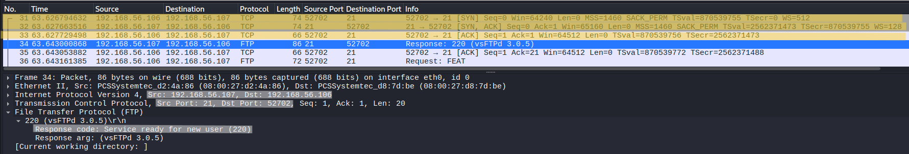
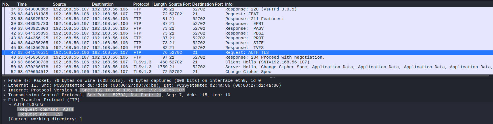
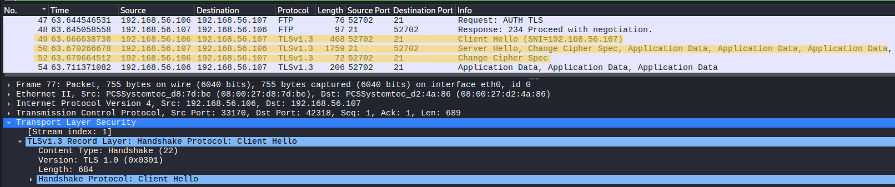
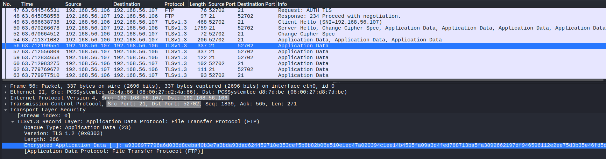
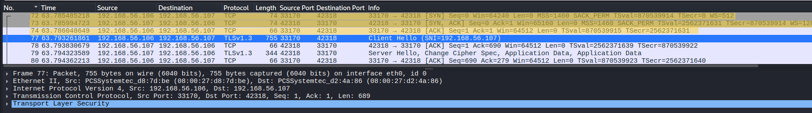
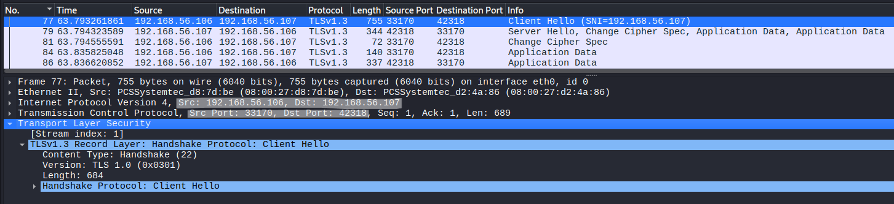
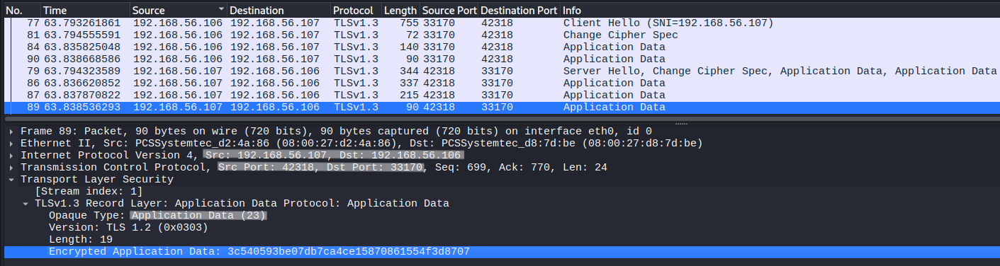

# FTPS Explicit Protocol Analysis

## Objective
Analyze Explicit FTPS (FTPES) communication at packet level to understand the transition from plaintext FTP to TLS encryption and the behavior of encrypted control and data channels without decryption.

---

## Lab Environment
- Kali Linux (Client)
- Ubuntu Server (vsftpd with TLS enabled)

---

## Network Configuration
- Client IP: 192.168.56.104  
- Server IP: 192.168.56.103  
- Protocol: FTPS (Explicit)  
- Control Port: 21  

---

## Tools Used
- Wireshark  
- lftp  

---

## Procedure

### Step 1 – Start FTPS Server
Ensure vsftpd is running with TLS enabled on Ubuntu server.

---

### Step 2 – Start Packet Capture
Start Wireshark on Kali Linux.

---

### Step 3 – Apply Filter
tcp.port == 21 || tls

---

### Step 4 – Connect to FTPS Server
lftp -u <username>,<password> ftp://192.168.56.103  
set ftp:ssl-force true  
set ftp:ssl-protect-data true  

---

### Step 5 – Trigger Encryption
Client sends AUTH TLS to upgrade the connection.

---

### Step 6 – Perform Operations
ls  
get readme.txt  
put upload_test.txt  

---

### Step 7 – Stop Capture
Stop Wireshark after transfer completes.

---

## Observation

---

### 1. TCP Connection Establishment

- TCP 3-way handshake observed (SYN, SYN-ACK, ACK)  
- Connection established on port 21  
- Server responds with 220 (vsFTPd 3.0.5)  

**Analysis:**

The session begins as a standard FTP connection in plaintext. No encryption is applied at this stage.

---

### 2. AUTH TLS (Protocol Transition)

- Client sends AUTH TLS  
- Server responds with 234 Proceed with negotiation  

**Analysis:**

This is the transition point where the client explicitly requests encryption.  
After this, the protocol shifts from FTP to TLS.

---

### 3. TLS Handshake (Control Channel)

- TLS handshake begins immediately after AUTH TLS  
- ClientHello followed by ServerHello observed  

**Analysis:**

The control channel is upgraded to TLS on the same TCP connection.  
Encryption is negotiated mid-session, not enforced at connection start.

Detailed TLS internals are covered separately in:  
../04-tls/01_TLS_Handshake_Analysis.md

---

### 4. Encrypted Control Channel

- TLS Application Data packets observed  
- No FTP commands visible  

**Analysis:**

After handshake completion, all control channel communication is encrypted.  
Authentication occurs in this phase but cannot be directly observed.

---

### 5. Data Channel Establishment

- New TCP connection initiated to high-numbered port  
- TCP handshake observed  
- TLS ClientHello appears immediately after  

**Analysis:**

A new connection is created for data transfer.  
Immediate TLS negotiation confirms it is part of the FTPS session.

---

### 6. TLS Handshake on Data Channel

- Independent TLS handshake observed  
- ClientHello and ServerHello visible  

**Analysis:**

FTPS establishes a separate TLS session for the data channel.  
Control and data channels are encrypted independently.

---

### 7. Encrypted Data Transfer

- Continuous TLS Application Data packets observed  
- No readable file content  

**Analysis:**

File transfer occurs over encrypted TLS records, preventing visibility of data.

---

## Data Channel Behavior

- Control Channel → commands (port 21, encrypted after AUTH TLS)  
- Data Channel → file transfer (dynamic ports, separately encrypted)  

- Each transfer:
  - Creates a new TCP connection  
  - Performs a separate TLS handshake  
  - Transfers encrypted data  
  - Closes after completion  

---

## Explicit FTPS Behavior

- Starts as plaintext FTP  
- Upgraded using AUTH TLS  
- Encryption applied after connection establishment  
- Negotiated security model  

---

## Security Analysis

- Credentials are not visible  
- Commands after AUTH TLS are hidden  
- File content is encrypted  
- Only traffic patterns remain observable  

---

## Note

- No TLS decryption performed  
- Analysis based on observable behavior only  
- FTP commands inside TLS are inferred  

---

## Why Full Packet Capture is Not Shown

Full packet capture introduces noise without improving understanding.

Selected packets highlight:
- Protocol transition  
- Encryption behavior  
- Channel separation  
- Clear evidence  

---

## Conclusion

Explicit FTPS upgrades a standard FTP session to TLS using AUTH TLS.  
Both control and data channels are encrypted independently, allowing secure communication while still exposing observable connection behavior for analysis.
