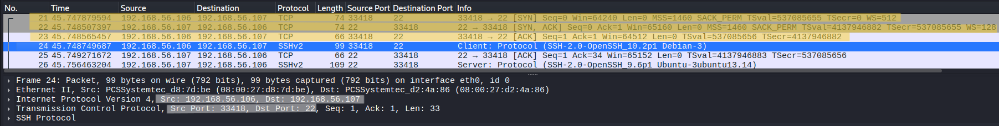
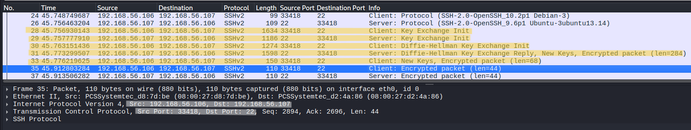
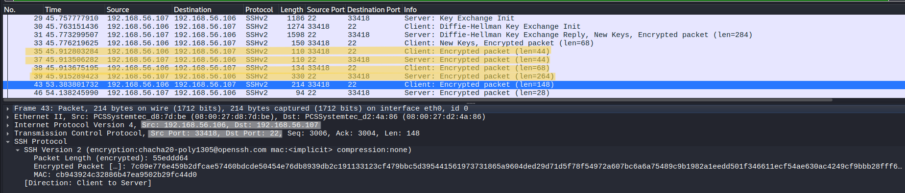
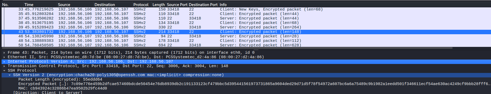
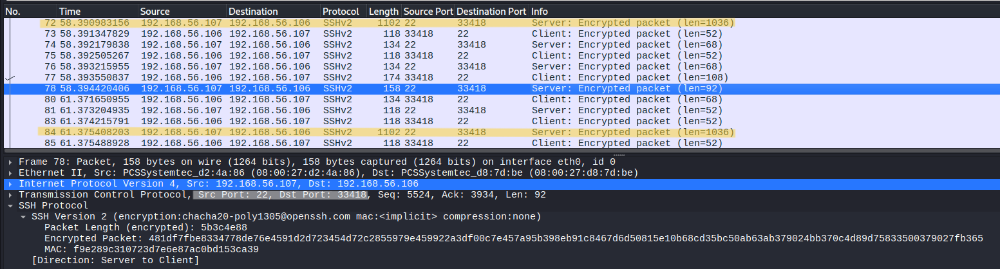

# SFTP Protocol Analysis

## Objective
Analyze SFTP communication at packet level to understand SSH-based encryption, authentication behavior, and file transfer activity through traffic patterns.

---

## Lab Environment
- Kali Linux (Client)
- Ubuntu Server (OpenSSH Server)

---

## Network Configuration
- Client IP: 192.168.56.106  
- Server IP: 192.168.56.107  
- Protocol: SFTP (SSH)  
- Port: 22  

---

## Tools Used
- Wireshark  
- sftp (OpenSSH client)  

---

## Procedure

### Step 1 – Start SSH Server
Ensure OpenSSH server is running on Ubuntu.

---

### Step 2 – Start Packet Capture
Start Wireshark on Kali Linux.

---

### Step 3 – Apply Filter
tcp.port == 22

---

### Step 4 – Connect to SFTP Server
sftp user@192.168.56.107

---

### Step 5 – Authenticate
Enter password for user.

---

### Step 6 – Perform Operations
ls  
get readme.txt  
put upload_test.txt  

---

### Step 7 – Stop Capture
Stop Wireshark after transfer completes.

---

## Observation

---

### 1. TCP Connection and SSH Banner

- TCP 3-way handshake observed (SYN, SYN-ACK, ACK)  
- Connection established on port 22  
- SSH version exchange observed (`SSH-2.0-OpenSSH`)  

**Analysis:**

This confirms the session is established using SSH protocol.  
Unlike FTP/FTPS, SFTP operates entirely over SSH.

---

### 2. SSH Key Exchange (KEX)

- Client and server exchange KEXINIT packets  
- Diffie-Hellman key exchange observed  
- New Keys message indicates encryption setup  

**Analysis:**

This phase establishes encryption parameters and session keys.  
After this point, all communication is encrypted.

---

### 3. Encrypted Session Establishment

- Encrypted SSH packets observed immediately after New Keys  
- No readable protocol data  

**Analysis:**

This marks the transition from structured SSH handshake to fully encrypted communication.  
All further operations occur within this encrypted channel.

---

### 4. Authentication Phase (Inferred)

- Short burst of encrypted bidirectional packets observed  
- Small packet sizes with rapid exchange  

**Analysis:**

Authentication is not directly visible due to encryption.  
It is inferred from the brief burst of packet exchange after encryption is established.

Successful authentication is confirmed by:
- No session termination  
- Continuation of communication  
- Transition to steady session behavior  

---

### 5. File Transfer Activity (Inferred)

- Large packet sizes observed (1000+ bytes)  
- Continuous data flow from server to client  
- Sustained encrypted traffic  

**Analysis:**

File transfer is identified through traffic patterns rather than protocol fields.

Characteristics:
- Larger packet sizes compared to authentication phase  
- Continuous flow instead of short bursts  
- Directional traffic (server → client for download)

This distinguishes file transfer from normal command activity.

---

## Protocol Behavior

- SFTP operates over a single SSH connection  
- No separate control and data channels  
- All communication is encrypted after key exchange  

Session flow:
- TCP connection  
- SSH handshake  
- Key exchange  
- Authentication (encrypted)  
- File operations (encrypted)  

---

## Key Observations

- No plaintext credentials or commands are visible  
- Authentication cannot be directly observed, only inferred  
- File transfer is identified using packet size and flow behavior  
- Entire session uses a single encrypted channel  

---

## Security Analysis

- Credentials are fully encrypted  
- File contents are not visible in packet capture  
- Strong protection against interception  
- Only traffic patterns remain observable  

---

## Note

SFTP does not expose protocol-level commands like FTP.  
All operations are encapsulated within SSH, requiring behavioral analysis instead of direct inspection.

---

## Why Full Packet Capture is Not Shown

Full capture contains large amounts of encrypted packets without additional insight.

Selected packets are used to:
- Show protocol phases  
- Highlight behavioral changes  
- Demonstrate authentication and transfer patterns  

---

## Conclusion

SFTP operates entirely over an encrypted SSH session, preventing visibility of credentials and file content.  
Analysis relies on traffic patterns and session behavior rather than protocol fields, making it fundamentally different from FTP and FTPS.
