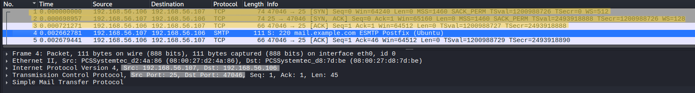
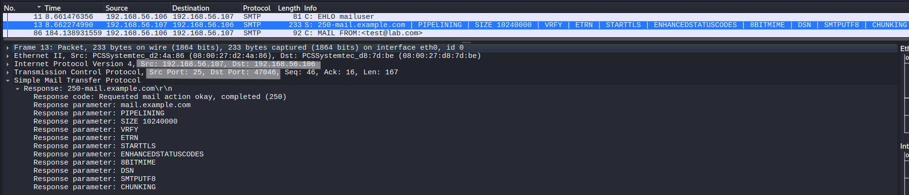
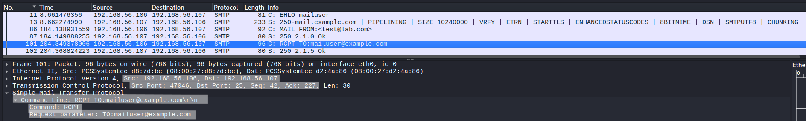
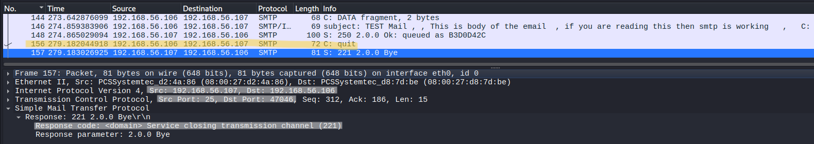

# SMTP Protocol Analysis

## Objective
Analyze SMTP communication at packet level to understand command-response behavior, envelope handling, message transmission, and plaintext exposure of email data.

---

## Lab Environment
- Kali Linux (Client)
- Ubuntu Server (Postfix SMTP Server)

---

## Network Configuration
- Client IP: 192.168.56.106  
- Server IP: 192.168.56.107  
- Protocol: SMTP  
- Port: 25  

---

## Tools Used
- Wireshark  
- Telnet  

---

## Procedure

### Step 1 – Start SMTP Server
Ensure Postfix is running on Ubuntu server.

---

### Step 2 – Start Packet Capture
Start Wireshark on Kali Linux.

---

### Step 3 – Apply Filter
tcp.port == 25

---

### Step 4 – Connect to SMTP Server
telnet 192.168.56.107 25

---

### Step 5 – Execute SMTP Commands
EHLO kali  
MAIL FROM:<test@lab.local>  
RCPT TO:<testuser@lab.local>  
DATA  

Subject: Test Mail  
From: test@lab.local  
To: testuser@lab.local  

This is a test email  
.  

QUIT  

---

### Step 6 – Stop Capture
Stop Wireshark after session ends.

---

## Observation

---

### 1. TCP Connection and SMTP Banner

- TCP 3-way handshake observed (SYN, SYN-ACK, ACK)  
- Connection established on port 25  
- Server responds with `220 lab.local ESMTP Postfix`  

**Analysis:**

The TCP handshake establishes a reliable connection between client and server.

- **SYN:** Client initiates connection with initial sequence number  
- **SYN-ACK:** Server acknowledges and provides its own sequence number  
- **ACK:** Client confirms, completing connection establishment  

The `220` response is the SMTP service banner:

- **220:** Service ready status code  
- **lab.local:** Server hostname  
- **ESMTP:** Indicates Extended SMTP support  
- **Postfix:** Mail server software  

This banner confirms:
- SMTP service availability  
- Server identity  
- Capability for extended commands (EHLO)

---

### 2. EHLO Command (Session Initialization)

- Client sends `EHLO kali`  
- Server responds with multiple `250` lines  

**Field Analysis:**

- **EHLO:** Extended Hello command (modern SMTP initialization)  
- **kali:** Client identifier (hostname)  

Server response:

- **250:** Request successful  
- Multiple lines indicate supported extensions  

**Analysis:**

EHLO initializes the SMTP session and negotiates capabilities.  
Unlike HELO, it enables extended features such as:

- SIZE limits  
- 8BITMIME  
- PIPELINING  

---

### 3. MAIL FROM (Envelope Sender)

- `MAIL FROM:<test@lab.local>`  
- Server responds with `250 OK`  

**Field Analysis:**

- **MAIL FROM:** Defines envelope sender  
- **<test@lab.local>:** Return-path address  

**Analysis:**

This field is used for:

- Bounce handling  
- Routing decisions  

It does NOT necessarily match the visible "From" header in the email body.  
This separation allows spoofing of sender identity.

---

### 4. RCPT TO (Envelope Recipient)

- `RCPT TO:<testuser@lab.local>`  
- Server responds with `250 OK`  

**Field Analysis:**

- **RCPT TO:** Defines recipient address  
- **<testuser@lab.local>:** Target mailbox  

**Analysis:**

This stage performs recipient validation.

- Server checks if mailbox exists  
- If rejected here → message is not processed further  

This is the final routing decision point before data transmission.

---

### 5. DATA Command (Message Transition)

- Client sends `DATA`  
- Server responds with `354 Start mail input`  

**Field Analysis:**

- **DATA:** Indicates start of message content  
- **354:** Server ready to receive message body  

**Analysis:**

This marks transition from:

- Command phase → message phase  

After this point:
- All input is treated as message content  
- SMTP commands are no longer interpreted  

---

### 6. Email Content (Message Body)

- Headers:
  - Subject  
  - From  
  - To  
- Body content visible  
- Message ends with `.`  

**Field Analysis:**

- **Headers:** Define metadata of email  
- **Body:** Actual message content  
- **`.` (dot):** Terminates message  

**Analysis:**

SMTP transmits entire email in plaintext:

- Headers are fully visible  
- Body content is readable  
- No encryption is applied  

This exposes sensitive information during transmission.

---

### 7. Session Termination

- Client sends `QUIT`  
- Server responds with `221 Bye`  

**Field Analysis:**

- **QUIT:** Terminates session  
- **221:** Service closing connection  

**Analysis:**

Graceful termination ensures:

- All data is processed  
- Connection is properly closed  

---

## Protocol Behavior

- SMTP follows a strict command-response model  
- Each client command is followed by server status code  

Session flow:

- TCP connection established  
- Server announces readiness (220)  
- Client initializes session (EHLO)  
- Envelope defined (MAIL FROM, RCPT TO)  
- Message transmitted (DATA)  
- Session terminated (QUIT)  

---

## Key Observations

- SMTP operates in plaintext  
- Commands and responses are fully visible  
- Email content is transmitted without encryption  
- Envelope and message content are handled separately  

---

## Security Analysis

- Sender identity (MAIL FROM) can be spoofed  
- Email content is exposed in transit  
- No confidentiality or integrity protection  
- Susceptible to interception and manipulation  

---

## Note

SMTP is responsible only for sending emails.  
Retrieval is handled by POP3 or IMAP.

---

## Why Full Packet Capture is Not Shown

Full capture introduces unnecessary noise.

Selected packets highlight:

- Command-response behavior  
- Envelope handling  
- Message transmission  
- Protocol structure  

---

## Conclusion

SMTP operates as a plaintext protocol using a command-response model to transmit email messages.  
The separation between envelope and content, along with lack of encryption, makes it efficient but insecure, requiring additional protocols (such as TLS) for secure communication.
