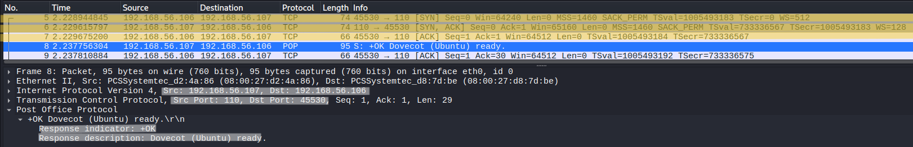
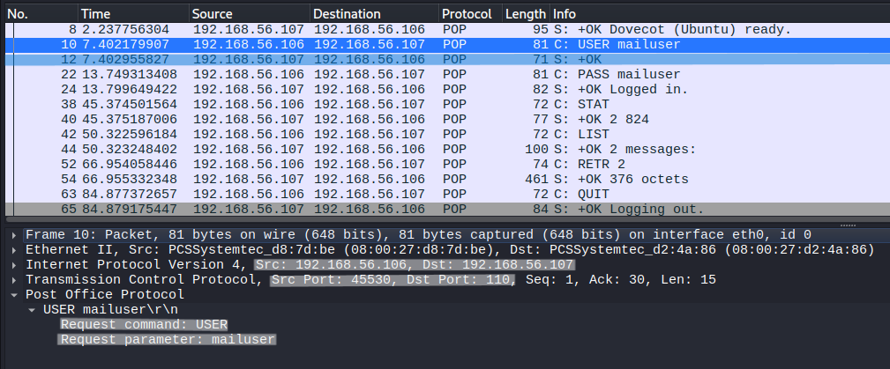
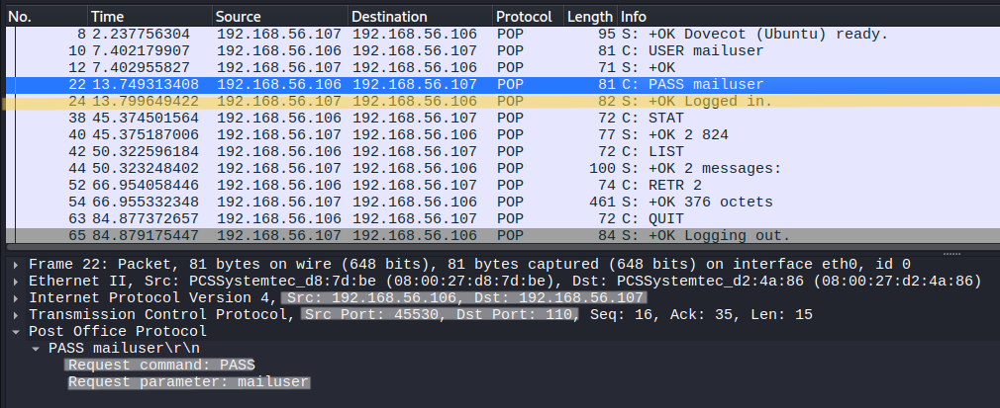
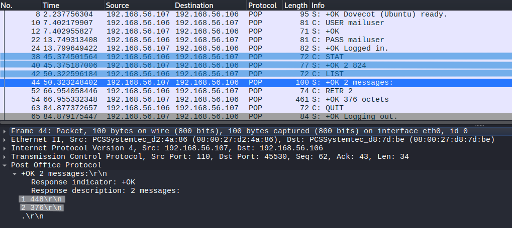
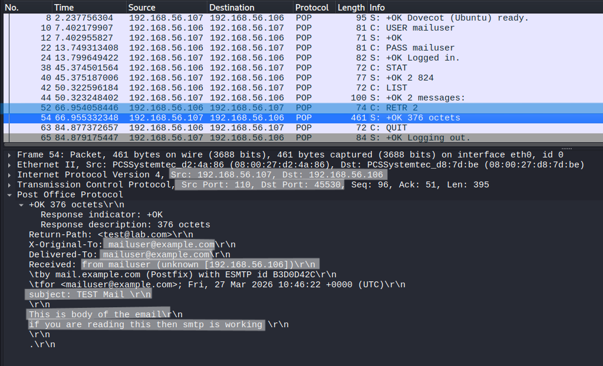
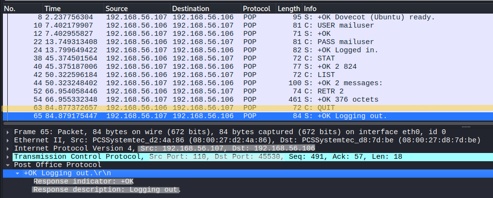

# POP3 Protocol Analysis

## Objective
Analyze POP3 communication at packet level to understand authentication, mailbox access, message retrieval, and plaintext exposure of credentials and email content.

---

## Lab Environment
- Kali Linux (Client)
- Ubuntu Server (Dovecot POP3 Server)

---

## Network Configuration
- Client IP: 192.168.56.106  
- Server IP: 192.168.56.107  
- Protocol: POP3  
- Port: 110  

---

## Tools Used
- Wireshark  
- Telnet  

---

## Procedure

### Step 1 – Start POP3 Server
Ensure Dovecot POP3 service is running on Ubuntu server.

---

### Step 2 – Start Packet Capture
Start Wireshark on Kali Linux.

---

### Step 3 – Apply Filter
tcp.port == 110

---

### Step 4 – Connect to POP3 Server
telnet 192.168.56.107 110

---

### Step 5 – Execute POP3 Commands
USER mailuser  
PASS mailuser  
STAT  
LIST  
RETR 1  
QUIT  

---

### Step 6 – Stop Capture
Stop Wireshark after session ends.

---

## Observation

---

### 1. TCP Connection and POP3 Banner

- TCP 3-way handshake observed (SYN, SYN-ACK, ACK)  
- Connection established on port 110  
- Server responds with `+OK Dovecot ready`  

**Analysis:**

The TCP handshake establishes the connection.

- SYN → client initiates  
- SYN-ACK → server acknowledges  
- ACK → connection established  

The POP3 banner:

- **+OK:** Positive response indicating server readiness  
- **Dovecot:** Mail server software  

This confirms POP3 service availability and readiness for authentication.

---

### 2. USER Command (Username Transmission)

- `USER mailuser` sent by client  
- Server responds with `+OK`  

**Field Analysis:**

- **USER:** Specifies mailbox username  
- **mailuser:** Target account  

**Analysis:**

The username is transmitted in plaintext.  
This identifies which mailbox the client wants to access.

---

### 3. PASS Command (Password Transmission)

- `PASS mailuser` sent by client  
- Server responds with `+OK Logged in`  

**Field Analysis:**

- **PASS:** Authentication password  
- **mailuser:** Plaintext credential  

**Analysis:**

The password is fully visible in packet capture.

This confirms:
- No encryption is used  
- Credentials can be intercepted  

Successful authentication is confirmed by:
- `+OK Logged in` response  
- Continued session activity  

---

### 4. Mailbox Statistics and Listing

- `STAT` returns message count and size  
- `LIST` returns message index and size  

**Field Analysis:**

- **STAT:** Total messages and mailbox size  
- **LIST:** Individual message details  

**Analysis:**

This phase provides metadata about the mailbox.

- Number of emails available  
- Size of each message  

No content is transferred yet.

---

### 5. RETR Command (Message Retrieval)

- `RETR 1` retrieves first message  
- Full email content visible  

**Field Analysis:**

- **RETR:** Retrieve message  
- **1:** Message index  

Message content includes:
- Headers (From, To, Subject)  
- Email body  

**Analysis:**

This is the most critical phase.

- Entire email is transmitted in plaintext  
- Same email sent via SMTP is retrieved here  

This demonstrates:
- End-to-end email flow  
- Lack of confidentiality  

---

### 6. Session Termination

- `QUIT` sent by client  
- Server responds with `+OK`  

**Field Analysis:**

- **QUIT:** Ends session  

**Analysis:**

Session is terminated cleanly after retrieval.

---

## Protocol Behavior

- POP3 follows a request-response model  
- Operates in three phases:
  - Authorization (USER, PASS)  
  - Transaction (STAT, LIST, RETR)  
  - Update (QUIT)  

Session flow:

- TCP connection established  
- Server announces readiness  
- Client authenticates  
- Mailbox accessed  
- Messages retrieved  
- Session closed  

---

## Key Observations

- Username and password are transmitted in plaintext  
- Email content is fully visible  
- POP3 retrieves entire messages, not partial data  
- Single-session interaction (connect → retrieve → disconnect)  

---

## Security Analysis

- Credentials exposed during authentication  
- Email content visible in network traffic  
- No encryption or integrity protection  
- Vulnerable to interception and credential theft  

---

## Note

POP3 is a simple retrieval protocol and does not support advanced features such as folder management or partial message access (unlike IMAP).

---

## Conclusion

POP3 operates as a plaintext protocol for retrieving email messages from a server.  
While simple and efficient, it exposes both credentials and email content, making it insecure for modern environments without encryption.
