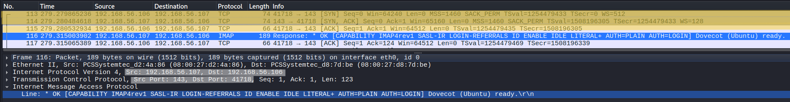
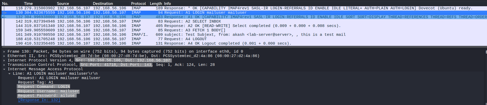
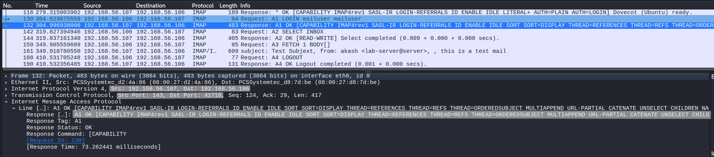
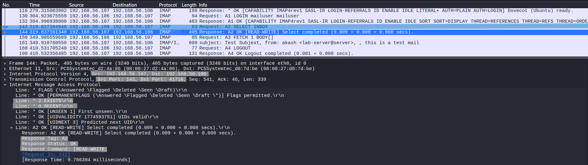
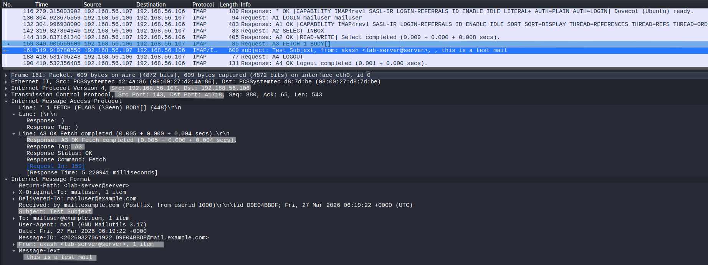
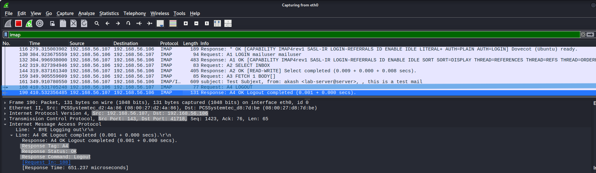

# IMAP Protocol Analysis

## Objective
Analyze IMAP communication at packet level to understand authentication, mailbox interaction, tagged command behavior, and selective message retrieval within a stateful session.

---

## Lab Environment
- Kali Linux (Client)
- Ubuntu Server (Dovecot IMAP Server)

---

## Network Configuration
- Client IP: 192.168.56.106  
- Server IP: 192.168.56.107  
- Protocol: IMAP  
- Port: 143  

---

## Tools Used
- Wireshark  
- Telnet  

---

## Procedure

### Step 1 – Start IMAP Server
Ensure Dovecot IMAP service is running on Ubuntu server.

---

### Step 2 – Start Packet Capture
Start Wireshark on Kali Linux.

---

### Step 3 – Apply Filter
tcp.port == 143

---

### Step 4 – Connect to IMAP Server
telnet 192.168.56.107 143

---

### Step 5 – Execute IMAP Commands
A1 LOGIN mailuser mailuser  
A2 SELECT INBOX  
A3 FETCH 1 BODY[HEADER]  
A4 FETCH 1 BODY[]  
A5 LOGOUT  

---

### Step 6 – Stop Capture
Stop Wireshark after session ends.

---

## Observation

---

### 1. TCP Connection and IMAP Banner

- TCP 3-way handshake observed (SYN, SYN-ACK, ACK)  
- Connection established on port 143  
- Server responds with `* OK [CAPABILITY ...] Dovecot ready`  

**Analysis:**

The TCP handshake establishes reliable communication.

The IMAP banner provides more information than POP3:

- **\* OK:** Server ready  
- **CAPABILITY:** Supported features  
- **Dovecot:** Server software  

This immediately exposes server capabilities before authentication.

---

### 2. LOGIN Command (Authentication)

- `A1 LOGIN mailuser mailuser`  
- Server responds with `A1 OK`  

**Field Analysis:**

- **A1:** Command tag (unique identifier)  
- **LOGIN:** Authentication command  
- **mailuser mailuser:** Username and password  

**Analysis:**

IMAP uses tagged commands to track requests and responses.

Credentials are transmitted in plaintext, making authentication vulnerable to interception.

Successful authentication is confirmed by:
- Matching tag in response (`A1 OK`)  
- Session continuation  

---

### 3. CAPABILITY Response

- Server advertises supported features  

**Field Analysis:**

- **CAPABILITY:** Lists server features  
- Examples:
  - IMAP4rev1  
  - STARTTLS  
  - AUTH mechanisms  

**Analysis:**

This defines what operations the client can perform.

Unlike SMTP EHLO, capability is often included in initial banner and can be queried again.

---

### 4. SELECT Mailbox (State Initialization)

- `A2 SELECT INBOX`  
- Server responds with mailbox details  

**Field Analysis:**

- **SELECT INBOX:** Opens mailbox  
- Server response includes:
  - EXISTS → number of messages  
  - FLAGS → message attributes  

**Analysis:**

This is a critical step.

- Establishes session state  
- Loads mailbox metadata  
- Enables further operations  

Unlike POP3, IMAP requires explicit mailbox selection.

---

### 5. FETCH Command (Selective Retrieval)

- `A3 FETCH 1 BODY[HEADER]`  
- `A4 FETCH 1 BODY[]`  

**Field Analysis:**

- **FETCH:** Retrieve message data  
- **1:** Message index  
- **BODY[HEADER]:** Only headers  
- **BODY[]:** Full message  

**Analysis:**

This demonstrates IMAP’s key advantage:

- Partial retrieval (headers only)  
- Full retrieval (entire message)  

Unlike POP3:
- No need to download entire message  
- Client can selectively access data  

This makes IMAP more efficient and flexible.

---

### 6. LOGOUT (Session Termination)

- `A5 LOGOUT`  
- Server responds with `* BYE` and `A5 OK`  

**Field Analysis:**

- **LOGOUT:** Ends session  
- **BYE:** Server closing connection  

**Analysis:**

Session is terminated cleanly while preserving mailbox state.

---

## Protocol Behavior

- IMAP uses a stateful client-server model  
- Commands are tagged for request-response tracking  
- Multiple operations occur within a single session  

Session flow:

- TCP connection established  
- Server announces capabilities  
- Client authenticates  
- Mailbox selected  
- Messages queried or retrieved  
- Session terminated  

---

## Key Observations

- Credentials are transmitted in plaintext  
- IMAP supports tagged commands (A1, A2, etc.)  
- Mailbox must be explicitly selected  
- Partial message retrieval is supported  
- Session remains active across multiple operations  

---

## Comparison with POP3

- POP3 retrieves entire messages and disconnects  
- IMAP allows selective access and persistent sessions  
- IMAP supports mailbox management and metadata  

---

## Security Analysis

- Credentials exposed during LOGIN  
- Email content visible when using plaintext IMAP  
- Supports STARTTLS for secure communication (not used here)  
- Vulnerable without encryption  

---

## Note

IMAP operates on server-stored mail, allowing clients to interact without downloading messages completely.

---

## Why Full Packet Capture is Not Shown

Full capture introduces unnecessary encrypted or repetitive traffic.

Selected packets highlight:
- Authentication  
- Mailbox interaction  
- Selective retrieval behavior  
- Protocol structure  

---

## Conclusion

IMAP provides a flexible and stateful mechanism for accessing email on a server.  
Its support for selective retrieval and persistent sessions makes it more advanced than POP3, but when used without encryption, it exposes credentials and message content in plaintext.
