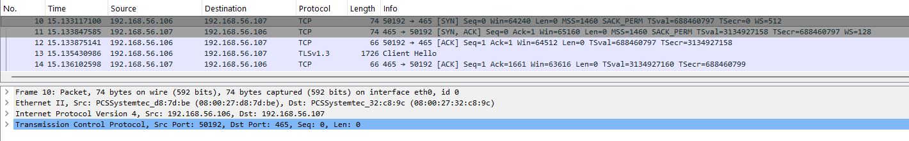
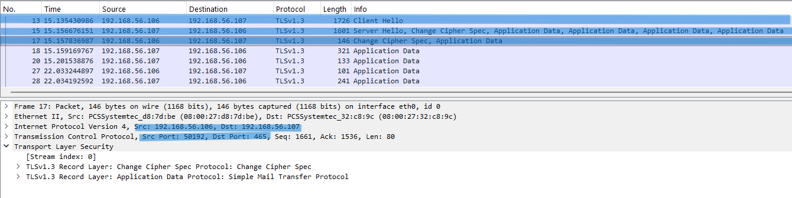
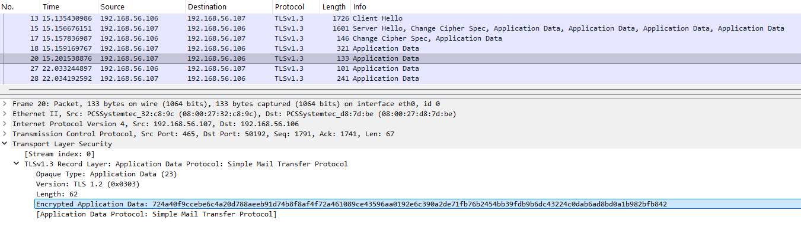
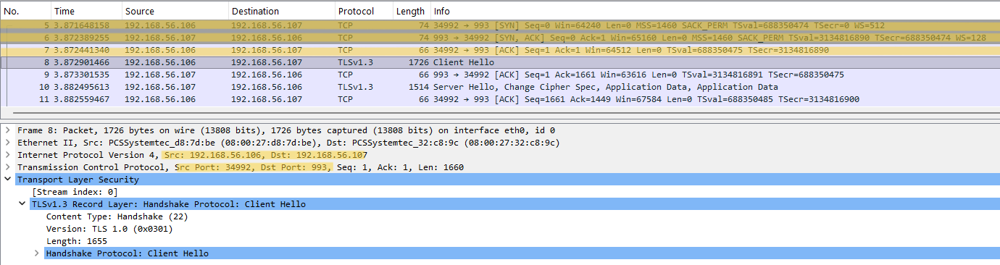
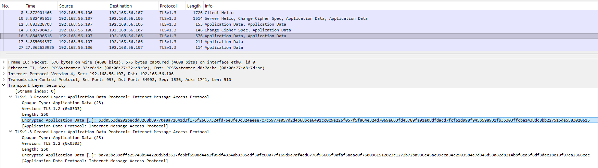
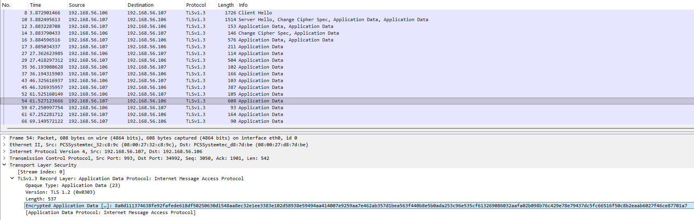
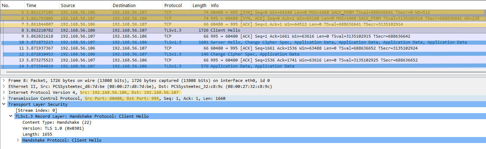

# Secure Email Protocols Analysis (SMTPS, IMAPS, POP3S)

## Objective
Analyze secure email protocols at packet level to understand how TLS encryption eliminates visibility of commands and content, requiring behavioral analysis instead of direct protocol inspection.

---

## Lab Environment
- Kali Linux (Client)
- Ubuntu Server (Postfix + Dovecot)

---

## Network Configuration
- Client IP: 192.168.56.106  
- Server IP: 192.168.56.107  
- Protocols: SMTPS, IMAPS, POP3S  
- Ports:
  - SMTPS → 465  
  - IMAPS → 993  
  - POP3S → 995  

---

## Tools Used
- Wireshark  
- OpenSSL (s_client)  

---

## Procedure

### Step 1 – Start Services
Ensure Postfix (SMTPS) and Dovecot (IMAPS, POP3S) services are running.

---

### Step 2 – Start Packet Capture
Start Wireshark on Kali Linux.

---

### Step 3 – Apply Filter
tcp.port == 465 || tcp.port == 993 || tcp.port == 995

---

### Step 4 – Connect to SMTPS
openssl s_client -connect 192.168.56.107:465

---

### Step 5 – Connect to IMAPS
openssl s_client -connect 192.168.56.107:993

---

### Step 6 – Connect to POP3S
openssl s_client -connect 192.168.56.107:995

---

### Step 7 – Perform Basic Interaction
Attempt authentication or simple commands within encrypted sessions.

---

### Step 8 – Stop Capture
Stop Wireshark after session activity.

---

## Observation

---

### 1. SMTPS TCP Connection and TLS Initiation

- TCP 3-way handshake observed  
- Immediately followed by TLS ClientHello  
- No SMTP banner visible  

**Analysis:**

SMTPS does not expose any plaintext protocol information.  
TLS negotiation begins immediately after TCP connection, preventing visibility of SMTP commands such as EHLO, MAIL FROM, or DATA.

---

### 2. SMTPS TLS Handshake

- ClientHello and ServerHello observed  
- TLS session established  

**Analysis:**

Encryption is established before any SMTP communication occurs.  
Unlike plaintext SMTP, no protocol fields or commands are visible.

---

### 3. SMTPS Encrypted Session

- TLS Application Data packets observed  
- No readable SMTP commands or email content  

**Analysis:**

All SMTP operations, including authentication and message transmission, are encapsulated within TLS.  
Only encrypted traffic patterns are visible.

---

### 4. IMAPS TCP Connection and TLS Initiation

- TCP handshake observed on port 993  
- TLS begins immediately  
- No IMAP banner visible  

**Analysis:**

IMAPS follows the same model as SMTPS, where encryption is applied before any protocol exchange.  
Commands such as LOGIN or FETCH are not visible.

---

### 5. IMAPS Encrypted Session

- Continuous TLS Application Data packets observed  
- No readable IMAP commands  

**Analysis:**

Mailbox interaction occurs entirely within encrypted TLS records.  
Authentication, mailbox selection, and message retrieval cannot be directly inspected.

---

### 6. Secure Data Flow Behavior

- Continuous encrypted packet flow observed  
- Larger packet sizes during activity  

**Analysis:**

User actions such as authentication and message retrieval are inferred through traffic patterns:

- Small bursts → session setup or authentication  
- Larger, continuous packets → data transfer  

This replaces direct protocol visibility.

---

### 7. POP3S Behavior (Brief Analysis)

- TCP handshake followed immediately by TLS ClientHello  
- No plaintext POP3 banner or commands visible  

**Analysis:**

POP3S behaves identically to other secure email protocols:

- USER and PASS commands are not visible  
- Message retrieval occurs within encrypted TLS  

Due to identical behavior with IMAPS and SMTPS, detailed analysis is omitted to avoid redundancy.

---

## Protocol Behavior

- Secure email protocols initiate TLS immediately after TCP connection  
- No plaintext protocol exchange occurs  
- All commands and data are encapsulated within TLS  

Session flow:

- TCP connection established  
- TLS handshake performed  
- Encrypted communication begins  
- User actions inferred through traffic patterns  

---

## Key Observations

- No visibility of authentication credentials  
- No visibility of email content  
- No protocol commands observable  
- Entire session appears as encrypted TLS traffic  

---

## Comparison with Plain Protocols

| Protocol | Visibility |
|---------|-----------|
| SMTP | Commands and content visible |
| POP3 | Credentials and messages visible |
| IMAP | Commands and content visible |
| SMTPS | No visibility |
| IMAPS | No visibility |
| POP3S | No visibility |

---

## Security Analysis

- Encryption protects credentials and email content  
- Prevents interception and data leakage  
- Eliminates protocol-level visibility  
- Analysis must rely on behavioral patterns  

---

## Note

Secure email protocols replace direct packet inspection with inference-based analysis due to encryption.

---

## Why Full Packet Capture is Not Shown

Full capture consists of encrypted TLS packets without additional readable insight.

Selected packets highlight:
- TLS initiation  
- Encrypted communication  
- Behavioral patterns  

---

## Conclusion

Secure email protocols such as SMTPS, IMAPS, and POP3S eliminate visibility of commands and data by applying TLS encryption from the start of the session.  
As a result, analysis shifts from protocol-level inspection to behavioral observation based on traffic patterns and session characteristics.
